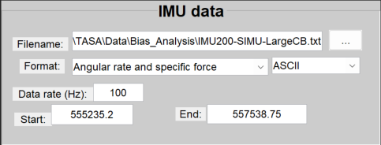
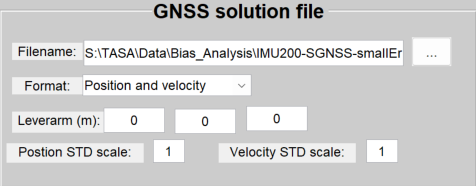
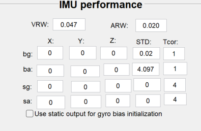
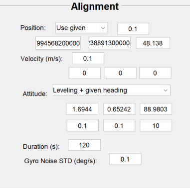

- 參考軌跡 (角速度、加速度) -> 轉檔 -> 6dof : **程式1**
  REF -> 6dof (REF.txt -> 6dof.csv)
- Simulator
	- Input:
		- 軌跡.csv (6dof)
		  logseq.order-list-type:: number
		- IMU規格
		  logseq.order-list-type:: number
		- GNSS規格
		  logseq.order-list-type:: number
		- 星曆(N檔)
		  logseq.order-list-type:: number
	- Output:
		- IMU
		  logseq.order-list-type:: number
		- satellite file
		  logseq.order-list-type:: number
		- observation file
		  logseq.order-list-type:: number
		- gnss solution file
		  logseq.order-list-type:: number
- Simulator -> **Raw: Range range rate** -> 
  **轉檔 -> TC**
- **TC**
	- Origin (介面上面)
	  logseq.order-list-type:: number
	- For Simulator (程式 + 介面)
	  logseq.order-list-type:: number
		- Input:
			- satellite file (XXX-Satellite.mat)
			  logseq.order-list-type:: number
			- observation file (XXX-SGNSS.mat)
			  logseq.order-list-type:: number
			- gnss solution file (XXX-SGNSS.txt)
			  logseq.order-list-type:: number
		- 流程:
			- 
			  logseq.order-list-type:: number
			- 
			  logseq.order-list-type:: number
			- 
			  logseq.order-list-type:: number
			- 
			  logseq.order-list-type:: number
			- 
			  logseq.order-list-type:: number
			- logseq.order-list-type:: number
-