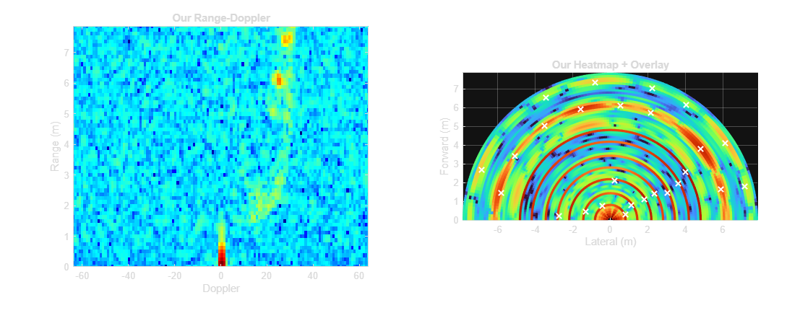
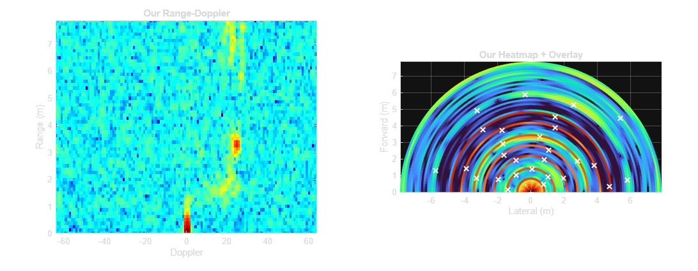

## FMCW mmwave radar FFT with Hanning window
	- ### Without Hanning Window
	  
	- ### With Hanning Window
	  
- ## Coloradar Dev Logs
	- ### Phase 1
	  Applied Coupling Calibration
	  Doppler FFT & Peak Integration
	  
	- 