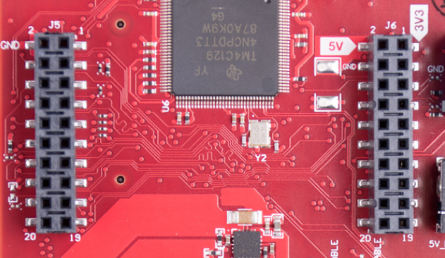
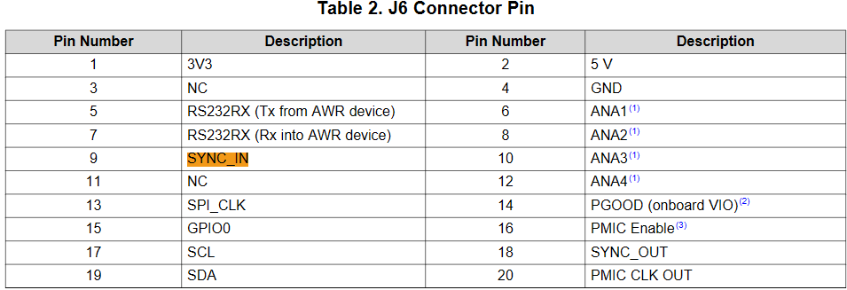

- #[[AWR1843 BOOST]] #awr1843 #[[time sync]] #trigger
- ## Source
	- [xWR1843 Evaluation Module (xWR1843BOOST)-User's Guide](https://www.ti.com/lit/ug/spruim4b/spruim4b.pdf?ts=1775795339104&ref_url=https%253A%252F%252Fwww.ti.com%252Ftool%252FIWR1843BOOST)
	- [AWR1843 Single-Chip 77 to 79GHz FMCW Radar Sensor](https://www.ti.com.cn/lit/ds/symlink/awr1843.pdf)
- ## Pinout
	- Connect **3.3v** pulse to **SYNC_IN** at **pin9, J6**
	- Connect **GND** to **pin4, J6**
	- 
	- 
- ## Configuration
	- ### The frameCfg Parameter Breakdown
	  The format for frameCfg in TI SDK 3.x is:
	  **frameCfg** <chirpStartIdx> <chirpEndIdx> <numLoops> <numFrames> <framePeriodicity> <triggerSelect> <frameTriggerDelay>
		- **<triggerSelect>**
			- **1 - Software Trigger (Internal)** — The radar starts based on its own internal timer (framePeriodicity).
			- **2 - Hardware Trigger (External)** — The radar waits for a pulse on the SYNC_IN hardware pin to start each frame.