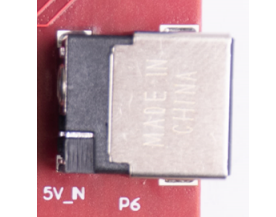
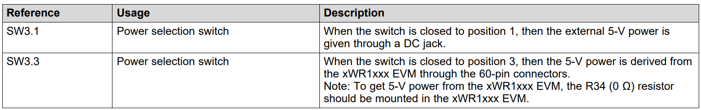
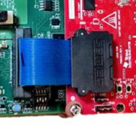
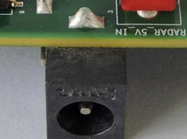
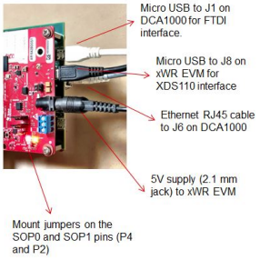
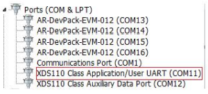
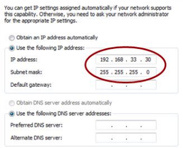
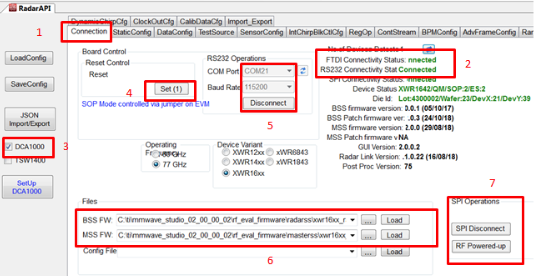
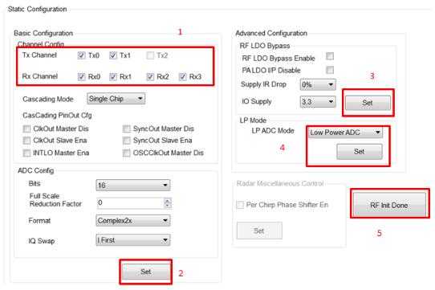

public:: true
title:: AWR1843-BOOST+DCA1000EVM_data_capture
#awr1843 #mmwave-radar #dca1000evm
{{renderer :tocgen}}

- ## Documents
	- [The fundamentals of millimeter wave radar sensors (Rev. A)](https://www.ti.com/lit/wp/spyy005a/spyy005a.pdf?ts=1665127395624&ref_url=https%253A%252F%252Fwww.ti.com%252Ftool%252FAWR1843BOOST)
	- [AWR1843BOOST and IWR1843BOOST Single-Chip mmWave Sensing Solution User's Guide (Rev. B)](https://www.ti.com/lit/ug/spruim4b/spruim4b.pdf?ts=1665127320807&ref_url=https%253A%252F%252Fwww.ti.com%252Ftool%252FAWR1843BOOST)
	- [DCA1000EVM Data Capture Card User's Guide (Rev. A)](https://www.ti.com/lit/ug/spruij4a/spruij4a.pdf?ts=1665117110972&ref_url=https%253A%252F%252Fwww.ti.com%252Ftool%252FDCA1000EVM)
	- **[DCA1000EVM Quick Start Guide](https://www.ti.com/lit/ml/spruik7/spruik7.pdf?ts=1665067397329)**
- ## Power Supply
  collapsed:: true
	- ### AWR1843 BOOST
		- 2.1 mm barrel jack(center positive), 5V > 2.5 A
		  
	- ### DCA1000EVM
	  **Power Selection Switch Information**
	   
	  Could be given through:
		- #### xWR1xxx EVM (J3 60 pin HD Connector)
			- 
		- #### External DC Power Jack
			- 2.1 mm barrel jack(center positive), 5V, 2.5 A  
			  
- ## Install Requirements
	- [MMWAVE-STUDIO](https://www.ti.com/tool/MMWAVE-STUDIO) (the FTDI drivers should be installed as well if needed)
	- [Matlab Runtime Engine](https://in.mathworks.com/supportfiles/downloads/R2015a/deployment_files/R2015aSP1/installers/win32/MCR_R2015aSP1_win32_installer.exe)
	- [XDS Emulation Software (EMU Pack)](https://software-dl.ti.com/ccs/esd/documents/xdsdebugprobes/emu_xds_software_package_download.html) (32-bit)
- ## Connection
  [DCA1000EVM使用指南](https://e2echina.ti.com/blogs_/b/the_process/posts/dca1000evm)
	- ### Wire Connection  
	     
	     
	  Should see the above picture (Device Manager) if all connection and drivers were connected correctly
	  **[Warning] Do not insert SD card**
	- ### Ethernet Settings
	  
- ## mmWave Studio
	- ### Execute mmWave Studio
	  Execute mmWave Studio under path _ti\mmwave_studio_02_01_01_00\mmWaveStudio\RunTime\mmWaveStudio.exe_
	  **As Administrator!!!!**
	- ### Connection Tab
	  
	  1. **FDTI Connectivity Status** -> **Connected (green)**
	  2. Select **DCA1000**
	  3. Click **Set** button in Reset control
	  4. Select **COM Port** in **RS232 Operations**, **RS232 Connectivity State** -> **Connected**. **Device Status** -> **mmWave EVM Version**
	  5. Select **.bin** file in **Files** block
	  * BSS FW: _mmwave_studio_02_00_00_02\rf_eval_firmware\radarss\xwr18xx_radarss.bin_
	  * MSS FW: _mmwave_studio_02_00_00_02\rf_eval_firmware\masterss\xwr16xx_masterss.bin_ 
	  * **Load** files to the board
	  6. Click **SPI connect** & **RF Power-up**
	- ### Static Config tab
	   
	  1. Select the Transmit and Receive antanna number in **channel config**
	  2. Select ADC parameters in **ADC Config**, then press **Set**
	  3. Select parameters in **Advanced Configuration**, then press **Set**
	  4. Select **Regular ADC** in **LP Mode**, then press **Set**
	  5. Press **RF init**
	-
	-