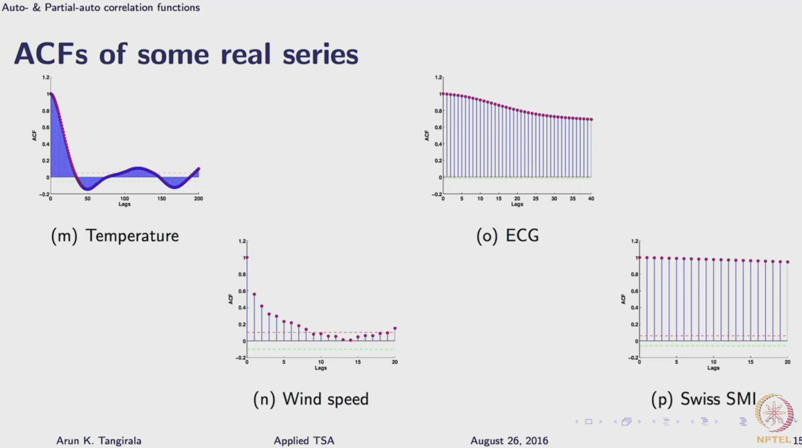

- {{renderer :tocgen2}}
- Info
	- [Video Link - # Lecture 12A: Autocovariance & Autocorrelation Functions](https://www.youtube.com/watch?v=YugzOoZh9Zk&list=PLl0FT6O_WWDBm-4W-eoK34omYmEMseQDX&index=31&pp=iAQB)
	- Predictable
	- $\{...v[k-1], v[k], v[k+1]...\}$
- ## Auto-covariance Function (ACVF)
	- ACVF is defined as the covariance between two observation of a series, $v[k_1]$ and $v[k_2]$  
	  $$\sigma_{vv}[k_1, k_2] = E( (v[k_1] - \mu_{k_1}) (v[k_2] - \mu_{k_2}) )$$  
	  where $\mu_{k_i}$ is the mean of the process at $k_i$ instant
	- ### ACVF of stationary process
		- the distribution is only a function of the **time difference** or **lag**, $l = k_1 - k_2$.  
		  Thus, the function is only the function of the **lag** $l$ between two observations,
		  $$\sigma_{vv}[l] = cov(v[k], v[k-l]) = E( (v[k] - \mu_v) (v[k-l] - \mu_v))$$  
		  where $\mu_v = E(v[k])$ is the mean of the stationary process
	- However,  ACVF is sensitive to units -> Autocorrelation function
- ## Auto-correlation Function (ACF)
	- ACF is defined as  
	  $$\rho_{vv}[l] = \frac{\sigma[l]}{\sigma_{v[k]} \sigma_{v[k-l]}} = \frac{\sigma_{vv}[l]}{\sigma_{v}^2}  \le 1$$
	- Example:  
	  
	- ## Interpreting ACF in predictions
		- Linear forcasring of a series at $k_2 = k + l$ given information only at $k_1 = k$
		  $$\hat{v}[k+l\ |\ v[k]] = \alpha v [k]$$
		  Then, the optimal value of $\alpha$ in the sense of
		  $$\underset{\alpha}{min}E( (v[k+l] - \hat{v}[k+l\ |\ v[k]])^2 ) = \underset{\alpha}{min}E( (v[k+l] - \alpha v[k])^2 )$$
		  is
		  $$\alpha^* = \rho_{vv}[l]$$
		- HINT: For two random varibles x, y, the optimal estimate $\alpha$ was a correlation between x, y
		- In case
		  $$\hat{v}[k+l\ |\ v[k]v[k-1]] = \alpha_1 v [k] + \alpha_2 v[k-1]$$
		  $\alpha_1$ and $\alpha_2$ depends on ACVF or ACF at lags of $l$ and $l+1$
	- ## Discovering signatures from ACF
		- Met hod for development / estimating time-series models implicitly or explicity involve **inverse mapping of the estimated ACF to the model parameters**.
		- ### None negative defeniteness
			- A sequence $\gamma[.]$ is said to be non-negative define if it satisfies
			  $$\sum_{i=1}^{n} \sum_{j=1}^{n} a_i \gamma [|i-j|]a_j \ge 0 \ \ \ \ \ \ \ \ a_i, a_j \in \mathbb{R} , n>0$$
		-