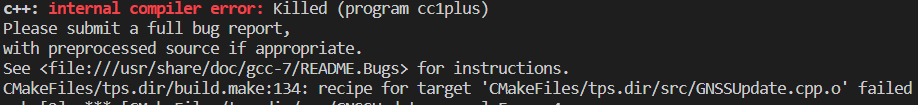
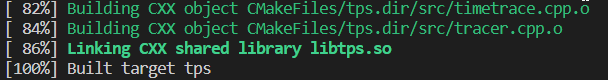

- ## c++: internal compiler error
	- ### Error message  
	  c++: internal compiler error: Killed (program cc1plus)
	- ### Problem
	  After excecuting `make -j16` in WSL  
	  {:height 89, :width 740}
	- ### Solution
	  According to [C++ 错误解决 —— internal compiler error](https://blog.csdn.net/fenquegong2126/article/details/80988452) the error were cause by lack of memory.  
	  Compiling with `make` instead of `make -j16`:  
	  