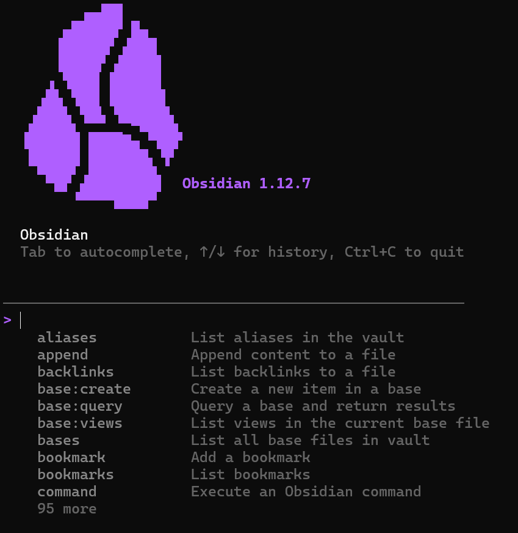

- #Obsidian #agent #ai #obsidian-cli
- {{renderer :tocgen2}}
- ## Enable obsidian-cli
	- ### Source
		- [Obsidian CLI](https://obsidian.md/cli)
	- **Settings > General > Enable Command Line Interface**
	- 
	- ### Test obsidian-cli
		- **Open Windows Command Prompt, and type `obsidian`**
		- ```bash
		  >obsidian
		  ```
		- The following interface will shows up if successfully enabled
		  **Need to follow the on-screen instruction to add the CLI to system PATH**
		  
- ## Obsidian Skills
	- ### Source
		- [kepano/obsidian-skills: Agent skills for Obsidian. Teach your agent to use Markdown, Bases, JSON Canvas, and use the CLI.](https://github.com/kepano/obsidian-skills/tree/main)
	- ### defuddle
	  Extract clean markdown content from web pages using Defuddle CLI,  removing clutter and navigation to save tokens. Use instead of  WebFetch when the user provides a URL to read or analyze, for  online documentation, articles, blog posts, or any standard web  page. Do NOT use for URLs ending in .md — those are already  markdown, use WebFetch directly.
	- ### json-canvas
	  Create and edit JSON Canvas files (.canvas) with nodes, edges,  groups, and connections. Use when working with .canvas files,  creating visual canvases, mind maps, flowcharts, or when the user  mentions Canvas files in Obsidian.
	- ### obsidian-bases
	  Create and edit Obsidian Bases (.base files) with views, filters,  formulas, and summaries. Use when working with .base files,  creating database-like views of notes, or when the user mentions  Bases, table views, card views, filters, or formulas in Obsidian.
	- ### obsidian-cli
	  Interact with Obsidian vaults using the Obsidian CLI to read,  create, search, and manage notes, tasks, properties, and more.  Also supports plugin and theme development with commands to  reload plugins, run JavaScript, capture errors, take screenshots,  and inspect the DOM. Use when the user asks to interact with  their Obsidian vault, manage notes, search vault content, perform  vault operations from the command line, or develop and debug  Obsidian plugins and themes.
	- ### obsidian-markdown
	  Create and edit Obsidian Flavored Markdown with wikilinks,  embeds, callouts, properties, and other Obsidian-specific syntax.  Use when working with .md files in Obsidian, or when the user  mentions wikilinks, callouts, frontmatter, tags, embeds, or Obsidian notes.