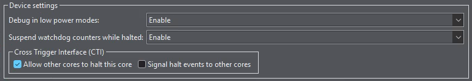

- #STM #[[Dual Core]] #STM32H7 #[[Cube IDE]] #MCU
  :LOGBOOK:
  CLOCK: [2026-04-29 Wed 21:26:25]--[2026-05-01 Fri 00:48:55] =>  27:22:30
  :END:
- {{renderer :tocgen2}}
- ## Resources
	- [STM32 Dual Core #1. Getting started with STM32 Dual Core CPUs || STM32H745 || How to DEBUG - YouTube]( https://youtu.be/jI1k6p-fduE?t=534)
	- [Dual Core Debugging on STM32H7 with STM32CubeIDE - YouTube](https://www.youtube.com/watch?v=k3mXhPZSasw)
	- [STM32CubeIDE使用总结（三）——debug调试程序_stm32cubeide debug-CSDN博客](https://blog.csdn.net/tuxinbang1989/article/details/100826820)
	- Gemini
- ## Debugger Configuration
	- ### Launching Debugger
	  id:: 69f5ab4e-a793-47f1-ab45-6096c92f823b
		- #### Debug Configuration
		  id:: 69f5ab4e-f459-4134-b24d-32ec27f435c8
			- Tool Bar: **Run > Debug Configurations...**
			  id:: 69f5ab4e-3b0d-4dd8-8364-b7b5cdbb2e64
			  collapsed:: true
			- Add New **STM32 C/C++ Application** Configuration. One for CM7 (as master), one for CM4.
			  
				- **Debugger** Tab
				  
					- GDB Connection Settings
					  * [x] `Autostart local GDB server`
					  * [ ] `Connect to remote GDB server`
						- Port number:
							- CM7: `61234`
							- CM4: `61238` (just use different port)
					- Debug probe: `ST-LINK (ST-LINK GDB server)`
					- Interface
					  * [x] `SWD`
						- Access port:
							- CM7: `0 - Cortex-M7`
							- CM4: `3 - Cortex-M4`
					- Reset behavior
					  Reset all cores before debugging
						- CM7:
						  * [x] `Halt all cores`
							- Type: `Connect under reset`
						- CM4:
							- Type: `None`
					- Misc
					  * [x] `Shared ST-LINK`
				- **Startup** Tab
				  
				  The Settings below allow Building Executables and download them in one click
					- **CM7**
					  **Add item > Project > `CM4-Project-Name`**
					  * [x] `Perform build`
					  * [x] `Download`
					  * [x] `Load symbols`
					- **CM4**
					  **Edit item > **
					  * [ ] `Download` (Uncheck)
					  (The Executable is already download in CM7 configuration)
		- #### Launch Group
		  collapsed:: true
			- Creating Launch Group allows running multiple debug configuration at once
			- Tool Bar: **Run > Debug Configurations...**
			- Add New **Launch Group**.
				- Add configuration for **CM7**
				  logseq.order-list-type:: number
				- Add configuration for **CM4**
				  logseq.order-list-type:: number
			- 
		- #### Run Debugger
		  collapsed:: true
			- **Run Dual Core Debugger with One Click!**
			- 
- ## Problems for Debugging Dual Core
	- ### CM7 and CM4 start order
		- #### Default Break Point
		  #+BEGIN_IMPORTANT
		  **It is Strongly suggested to Disable the Break at Main option** 
		  #+END_IMPORTANT
			- If the **Set breakpoint at: main** option is checked
			- The debugger will **pause at the beginning of main()** function. Which might leads to the problem discuss in ((69f1f536-ffae-44ca-b10f-d59be1d89391))
		- #### CM7 release CM4 point
		  id:: 69f1f536-ffae-44ca-b10f-d59be1d89391
			- #+BEGIN_WARNING
			  **If the CM7 debugger halt the core before HSEM release for CM7, the CM4 will be unreachable by STLINK:**
			  #+END_WARNING 
			  ```text
			  Starting server with the following options:
			          Persistent Mode            : Disabled
			          Logging Level              : 1
			          Listen Port Number         : 61238
			          Status Refresh Delay       : 15s
			          Verbose Mode               : Disabled
			          SWD Debug                  : Enabled
			  
			  Failed to read ROM table via AP 3
			  
			  Error in initializing ST-LINK device.
			  Reason: Unknown. Please check power and cabling to target.
			  ```
			- On the [[STM32H7]], the **Cortex-M7 is the [[Boot]] Master**. After a system reset, the CM4 core is automatically held in a low-power "Wait For Event" (WFE) state.
			- This ensures that the M4 doesn't attempt to access peripherals or memory before the M7 has finished critical system-wide configurations (like Clock Trees and Power Domains).
			- The following code shows the M7 using the **Hardware Semaphore (HSEM)** to signal to the M4 that the system is ready:
			- ```c
			  /* When system initialization is finished, Cortex-M7 will release Cortex-M4 by means of
			  HSEM notification */
			  /*HW semaphore Clock enable*/
			  __HAL_RCC_HSEM_CLK_ENABLE();
			  /*Take HSEM */
			  HAL_HSEM_FastTake(HSEM_ID_0);
			  /*Release HSEM in order to notify the CPU2(CM4)*/
			  HAL_HSEM_Release(HSEM_ID_0,0);
			  /* wait until CPU2 wakes up from stop mode */
			  ```
	- ### Halting (breakpoints) Cores Simultaneously
	  #+BEGIN_WARNING
	  **CM7 Should aways runs ahead of CM4!**
	  #+END_WARNING
		- #### Cross Trigger Interface (CTI)
		   
		  
		  This option allows pausing core together
		  * [ ] `Allow other cores to halt this core`
		  * [ ] `Signal halt events to other cores`
		  **I enabled the following options**, see below blocks for reason
			- **CM7**: `Signal halt events to other cores`
			- **CM4**: `Allow other cores to halt this core`
		- #### Priority of CM7 & CM4
			- There is no function for synchronous Resume
			- **Aways Resume CM7 before CM4 !!**
		- #### CM7 halting CM4
			- Since CM7 is aways running ahead of CM4
		- #### ~~CM4 halting CM7~~
			- CM7
- ## Dual Core Running Structure
	- ### 1. Orchestration (CM7 Launch)
		- The CM7 Debug Configuration acts as the "Master" launcher.
		- **Flash Bank 2 Update:** Downloads the CM4.
		- **Flash Bank 1 Update:** Downloads the CM7.
		- *Note: This ensures both cores have the latest code in a single click.*
	- ### 2. Core Initialization
		- **CM7 (Master):** Connects "Under Reset", performs a Hardware Reset, and halts at `main()` if **Set breakpoint at: main** was enabled.
		- **CM4 (Slave):** The second debug configuration (CM4) connects to the running target, loads symbols, but **skips download** to avoid overwriting Bank 2 again.
	- ### 3. Boot Sequence
		- CM7 starts -> Executes SystemInit.
		- CM7 reaches the **HSEM/RCC** code -> Releases CM4.
		- CM4 "wakes up" from its hardware hold and begins.