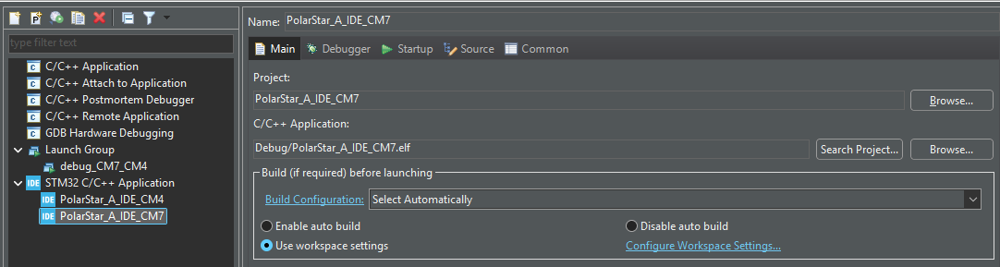
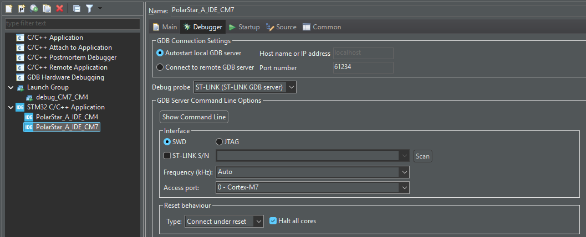
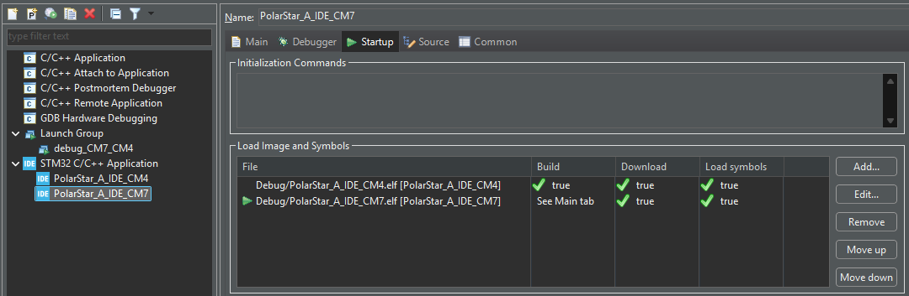
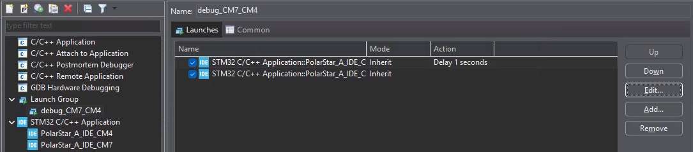
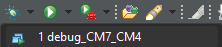

- DOING #STM #[[Dual Core]] #STM32H7 #[[Cube IDE]] #MCU
  :LOGBOOK:
  CLOCK: [2026-04-29 Wed 21:26:25]
  :END:
- {{renderer :tocgen2}}
- ## Resources
	- [STM32 Dual Core #1. Getting started with STM32 Dual Core CPUs || STM32H745 || How to DEBUG - YouTube]( https://youtu.be/jI1k6p-fduE?t=534)
	- [Dual Core Debugging on STM32H7 with STM32CubeIDE - YouTube](https://www.youtube.com/watch?v=k3mXhPZSasw)
	- [STM32CubeIDE使用总结（三）——debug调试程序_stm32cubeide debug-CSDN博客](https://blog.csdn.net/tuxinbang1989/article/details/100826820)
- ## Problems for Debugging Dual Core
	- ### Launching Debugger
		- #### Debug Configuration
			- Tool Bar: **Run > Debug Configurations...**
			- Add New **STM32 C/C++ Application** Configuration. One for CM7 (as master), one for CM4.
			  
				- **Debugger** Tab
				  collapsed:: true
				  
					- GDB Connection Settings
					  * [x] `Autostart local GDB server`
					  * [ ] `Connect to remote GDB server`
						- Port number:
							- CM7: `61234`
							- CM4: `61238` (just use different port)
					- Debug probe: `ST-LINK (ST-LINK GDB server)`
					- Interface
					  * [x] `SWD`
						- Access port:
							- CM7: `0 - Cortex-M7`
							- CM4: `3 - Cortex-M4`
					- Reset behavior
					  Reset all cores before debugging
						- CM7:
						  * [x] `Halt all cores`
							- Type: `Connect under reset`
						- CM4:
							- Type: `None`
					- Misc
					  * [x] `Shared ST-LINK`
				- **Startup** Tab
				  collapsed:: true
				  
				  The Settings below allow Building Executables and download them in one click
					- **CM7**
					  **Add item > Project > `CM4-Project-Name`**
					  * [x] `Perform build`
					  * [x] `Download`
					  * [x] `Load symbols`
					- **CM4**
					  **Edit item > **
					  * [ ] `Download` (Uncheck)
					  (The Executable is already download in CM7 configuration)
		- #### Launch Group
			- Creating Launch Group allows running multiple debug configuration at once
			- Tool Bar: **Run > Debug Configurations...**
			- Add New **Launch Group**.
				- Add configuration for **CM7**
				  logseq.order-list-type:: number
				- Add configuration for **CM4**
				  logseq.order-list-type:: number
			- 
		- #### Run Debugger
			- **Run Dual Core Debugger with One Click!**
			- 
	- ### CM7 and CM4 start order
		- #### Default Break Point
			- If the **Set breakpoint at: main** option is checked
			- 
		- #### CM7 release CM4 entry point
			- ```c
			  /* When system initialization is finished, Cortex-M7 will release Cortex-M4 by means of
			  HSEM notification */
			  /*HW semaphore Clock enable*/
			  __HAL_RCC_HSEM_CLK_ENABLE();
			  /*Take HSEM */
			  HAL_HSEM_FastTake(HSEM_ID_0);
			  /*Release HSEM in order to notify the CPU2(CM4)*/
			  HAL_HSEM_Release(HSEM_ID_0,0);
			  /* wait until CPU2 wakes up from stop mode */
			  ```
	- ### Halting Cores Simultaneously
	  #+BEGIN_WARNING
	  **CM7 Should aways runs ahead of CM4!**
	  #+END_WARNING
		- #### Priority of CM7 & CM4
		- #### CM7 halting CM4
		- #### ~~CM4 halting CM7~~
- ## Dual Core Running Structure
	- Build CM7 > Download CM7
	- Build CM4 > Download CM4
	- Connecting CM7 Debugger
		- Halt and resume
	- Connecting CM4 Debugger
		- Halt and resume