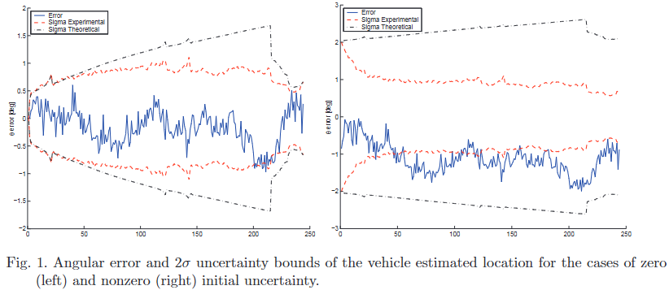

- #EKF #consistency
- ## References
	- [[@Limits to the consistency of EKF-based SLAM]]
- 
- ## EKF Consistency
  From Chapter 3 of [[@Limits to the consistency of EKF-based SLAM]]
	- ### 3. THE INCONSISTENCY OF EKF SLAM
	- A state estimator is called ~consistent~ if its state estimation error $x_k^W - \hat{x}_k^W$ satisfies:
	- $$E \left[ x_k^W - \hat{x}_k^W \right] = 0$$
	- $$E \left[( x_k^W - \hat{x}_k^W \right) (x-k^W - \hat{x}_k^W)^T] = P_k^W$$
	- This means that the estimator is unbiased and that the actual Mean Square Error matches the filter calculated covariances. Given that SLAM is a nonlinear problem, consistency checking is of paramount importance. When the ground true solution for the state variables is available, a statistical test for filter consistency can be carried out on the Normalized Estimation Error Squared
	  (NEES), defined as:
	- $$D^2 = (x_k^W - \hat{x}_k^W)^T (P_k^W)^{-1} (x_k^W - \hat{x}_k^W)$$
	- Consistency is checked using a chi-squared test:
	- $$D^2 \le \Chi_{r,1-\alpha}^2$$
	- where $r = dim(x_k^W )$ and α is the desired significance level (usually 0.05).