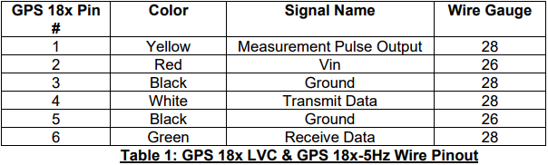
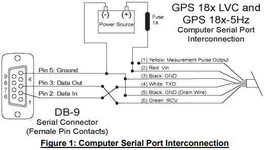

sensor:: GNSS
manufacturers:: Garmin
model:: GPS 18x LVC
{{renderer :tocgen2}}

- ## User Manual
	- [GPS 18x Tech Specs (garmin.com)](https://static.garmin.com/pumac/GPS_18x_Tech_Specs.pdf)
- ## Software
  id:: 65df6c3a-8148-47a5-98ab-18fc842ff0fb
	- [Garmin SNSRXCFG](https://www8.garmin.com/support/download_details.jsp?id=4053) (**Suggested**)
	  id:: 65df6c45-865f-4c72-af68-e8847523913d
	- [Garmin: SNSRCFG Updates & Downloads](https://www8.garmin.com/support/download_details.jsp?id=925)
	  id:: 65df6cbe-52fe-432f-961a-e6b8c28a8088
- ## Wiring & Pin Outs
  
	- In order to reconfigure the GPS with Garmin ((65df6c3a-8148-47a5-98ab-18fc842ff0fb)). The wires 
	  