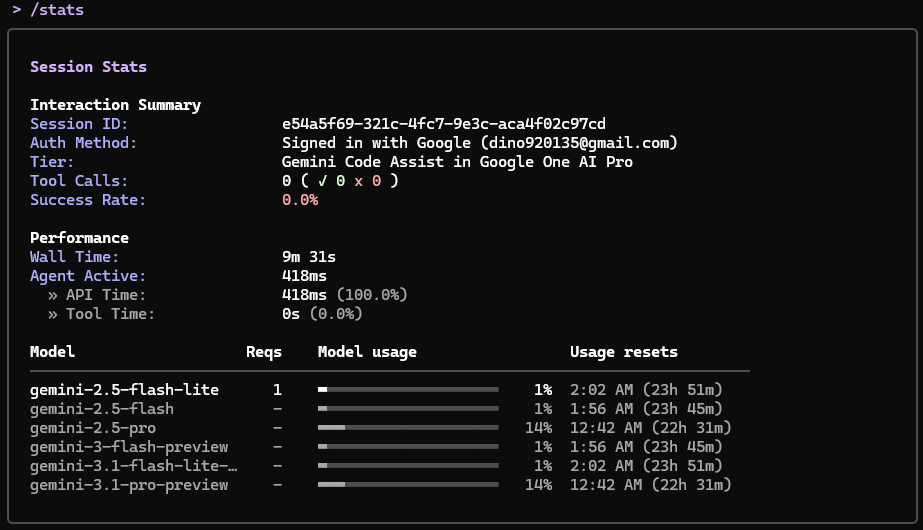

- #gemini #agent #ai #skills #cli #llm
- ## Installation #install
	- Follow the instruction in: 
	  [Github: google-gemini/gemini-cli](https://github.com/google-gemini/gemini-cli)
	- ### Windows #windows
	  collapsed:: true
		- Install node.js first from [Node.js — Download Node.js®](https://nodejs.org/en/download)
		- Install Gemini CLI with **Command Prompt**
		  ```shell
		  npm install -g @google/gemini-cli
		  ```
	- ### WSL #wsl
	  collapsed:: true
		- #### Install node.js
			- ```bash
			  curl -o- https://raw.githubusercontent.com/nvm-sh/nvm/v0.40.3/install.sh | bash
			  ```
			- Restart the terminal
			  ```bash
			  nvm install --lts
			  ```
		- #### Install Gemini cli
			- ```bash
			  npm install -g @google/gemini-cli
			  ```
	- ### Ubuntu (Linux) #linux
	  collapsed:: true
		- #### Install node.js
			- ```bash
			  curl -o- https://raw.githubusercontent.com/nvm-sh/nvm/v0.40.3/install.sh | bash
			  ```
			- Restart the terminal
			  ```bash
			  nvm install --lts
			  ```
		- #### Install Gemini cli
			- ```bash
			  npm install -g @google/gemini-cli
			  ```
- ## Basic usage
	- ### Slash commands
		- `/stats`:
		  Check session/model/tools usage statistic
		  
		- `/skills` #skills
			- `/skills lists`
		- `/chat`
		- `/tools`
- ## GEMINI.md
- ## Extensions
- ## Reference
	- [安裝 Gemini Cli 筆記 – 仲佑的網誌](https://yowlab.idv.tw/wordpress/?p=3172)
	- [Github: google-gemini/gemini-cli](https://github.com/google-gemini/gemini-cli)
	-