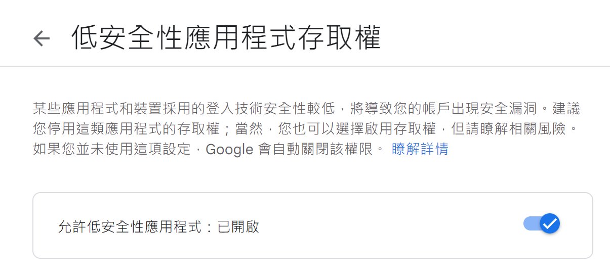
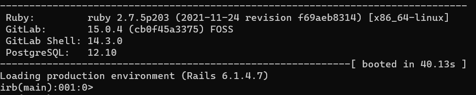
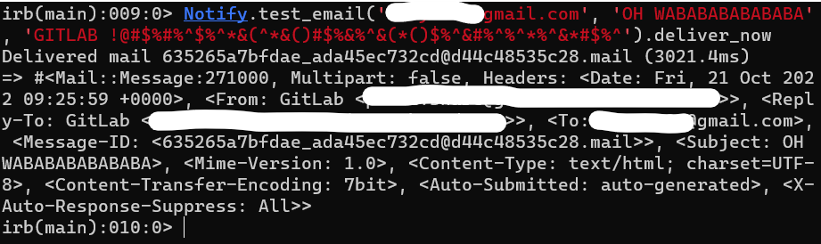

title:: GitLab_sent_mail_with_Gmail_SMTP

- # GitLab sent mail with Gmail SMTP
- ## Documantation
	- [GitLab Docs - SMTP settings](https://docs.gitlab.com/omnibus/settings/smtp.html#gmail)
	- [GitLab 設定 Email 透過 Gmail SMTP 發送信件 (筆記)](https://blog.toright.com/posts/7019/gitlab-gmail-smtp-send-setup.html)
- ## Enable Google [Less Secure Apps](https://www.google.com/settings/security/lesssecureapps)
	- However, this function had been disable seens 2022/05/30. Only **Google Workspace** and **Google Cloud Identity** users can still use this function.
	  
- ## Edit gitlab.rb file
	- Edit `/etc/gitlab/gitlab.rb` file as follow
	  ```
	  external_url 'http://your-doamin'
	  gitlab_rails['time_zone'] = 'Asia/Taipei'
	  gitlab_rails['gitlab_email_enabled'] = true
	  gitlab_rails['gitlab_email_from'] = 'your_email'
	  gitlab_rails['gitlab_email_display_name'] = 'GitLab'
	  gitlab_rails['gitlab_shell_ssh_port'] = 22
	  gitlab_rails['smtp_enable'] = true
	  gitlab_rails['smtp_address'] = 'smtp.gmail.com'
	  gitlab_rails['smtp_port'] = 587
	  gitlab_rails['smtp_user_name'] = 'your_email'
	  gitlab_rails['smtp_password'] = 'your_email_password'
	  gitlab_rails['smtp_domain'] = 'smtp.gmail.com'
	  gitlab_rails['smtp_authentication'] = 'login'
	  gitlab_rails['smtp_enable_starttls_auto'] = true
	  gitlab_rails['smtp_tls'] = false
	  gitlab_rails['smtp_openssl_verify_mode'] = 'peer'
	  ```
- ## Test Sending Email
	- The email can be send manually throuugh Gitlab Debug Console.
	  1. Enter console with the below command (it may take a while).
	  ```bash
	  gitlab-rails console
	  ```
	  
	  2. Then the email can be send with the follow command:
	  ```bash
	  Notify.test_email('your_email', 'test', 'test').deliver_now
	  ```
	  3. If the mail were sent sucessful, should see the following output
	  
-