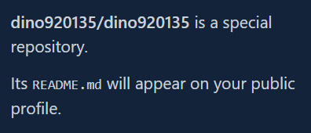

title:: Github_Profile

- ## Create
  Create a reposotiry which has the same name as **user id**, Github should remind you that it was a special repository. Check the option **Initialize this repository with a README** while creating the reposotory or create a README.md later  
  
- ## Templates
	- [GitHub Profile Summary Cards](https://github.com/vn7n24fzkq/github-profile-summary-cards)  
	  
- ## Reference
	- [如何建立獨一無二的 GitHub Profile！與三個很酷的設計及應用](https://medium.com/starbugs/%E5%A6%82%E4%BD%95%E5%BB%BA%E7%AB%8B%E7%8D%A8%E4%B8%80%E7%84%A1%E4%BA%8C%E7%9A%84-github-profile-%E8%88%87%E4%B8%89%E5%80%8B%E5%BE%88%E9%85%B7%E7%9A%84%E8%A8%AD%E8%A8%88%E5%8F%8A%E6%87%89%E7%94%A8-ef1cbb4b42c1)