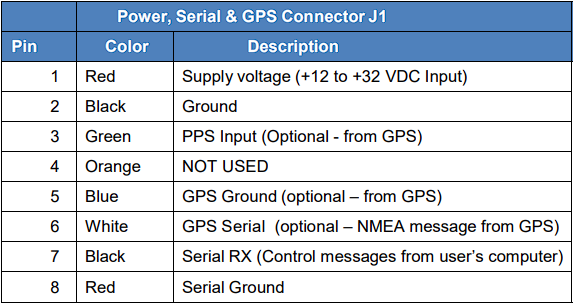

sensor:: lidar
manufacturers:: velodyne
model:: HDL-64E S3
{{renderer :tocgen2}}

- ## Reference Documents
	- [Installation guide of Velodyne HDL64E-S3 — Apollo Auto 0.0.1 文档 (daobook.github.io)](https://daobook.github.io/apollo/docs/specs/Lidar/HDL64E_S3_Installation_Guide.html)
	- [HDL-64E_S3_UsersManual.pdf](https://www.google.com/url?sa=t&rct=j&q=&esrc=s&source=web&cd=&cad=rja&uact=8&ved=2ahUKEwjv-4WJt86EAxUplK8BHaFxDgMQFnoECA8QAQ&url=https%3A%2F%2Fwww.researchgate.net%2Fprofile%2FJoerg_Fricke%2Fpost%2FHow_the_LiDARs_photodetector_distinguishes_lasers_returns%2Fattachment%2F5fa947b8543da600017dcf9b%2FAS%253A955957442002980%25401604929423693%2Fdownload%2FHDL-64E_S3_UsersManual.pdf&usg=AOvVaw2E3LxA20VivnNmwh9RWsNT&opi=89978449)
- ## Wiring & Pin outs
	- 
- ## Time Pulse Setup
	- For **External GPS Time Synchronization** only the following wires is required:
		- (Green) PPS Input
			- Once-a-second sychronization pulse, length of the pulse is not critical (usually between 20ms - 200ms)
		- (White) GPS Serial
			- Once-a-second $GPRMC NMEA message. Start the $GPRMC NMEA between 50ms - 500ms after the end of the sync pulse.
			  
			  Eample of the $GPRMC message with time in hhmmss format. 
			  **e.g. $GPRMC,170506,......... -> 17:05:06**
		- (Blue )  GPS Ground
		-