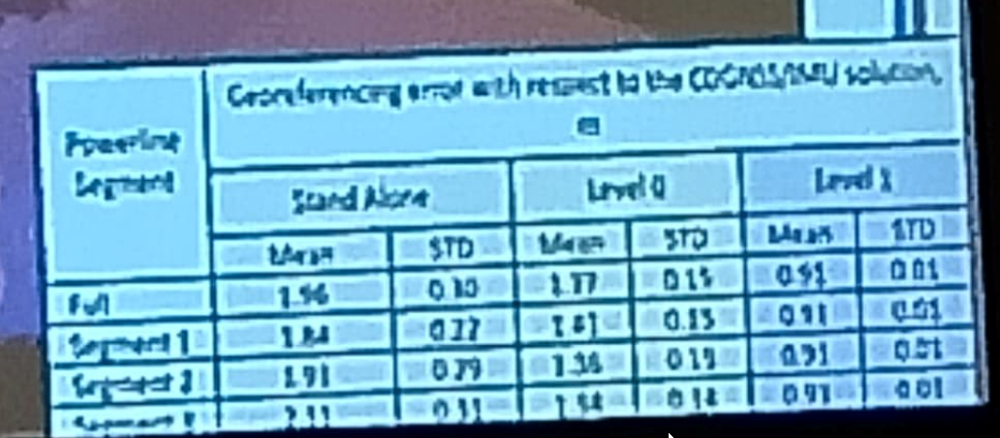
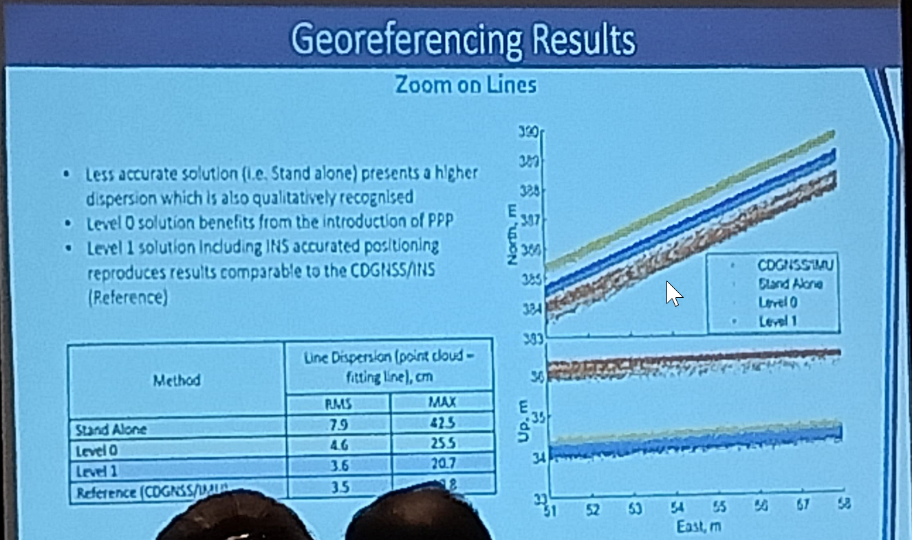

title:: ION_Notes

- GNSS Attitude determination algorithm using Optimization Tech on Riemannian Manifolds
  collapsed:: true
	- GNSS attitude model
	- GNSS attitude model Constrain
		- Integer
		- ortho
	- Riemannian Optimization
		- reduce dimention
		- fewer nnumber of opration
	- Search interger
	- Comparing with MC Lambda
- Combining High Precision and Interference Resilient Positioning Spatial filtering for real-world jamming
  collapsed:: true
	- Antenna array
		- phase center error
	- steering vector
	- How to calulate the beamform
		- eigenbeamformer
		- buikd the real steering vector
			- max sig power
	- slow change jammer
	- rapid change
		- single
		- blind
		- deterninistic
	-
- PPP and IMU refernced LiDAR Data for 3D Mapping and monitoring of arial electric power lines
  collapsed:: true
	- electic line reconstruction
	- AMPERE
	- 
	- 
- GNSS-based Train Localization Integrety Performance Evaluation
  collapsed:: true
	- EUSPA H2020 grant (70%)
	- performance term defenition
	- CI interval performance prediction
		- geo time/track direction sampling
		- Model of masking & evaluation with FDE -> Availiable GNSS measurement
		- Fusion & error model
		- track direction preception & safety factor
		- solution for CI
	-
- Application of ML in to GNSS/IMU Integration for High Precision Positioning on smartphones
  collapsed:: true
	- TULEVA project
		- warehouse managment & smart logistics
	- ML in GNSS
		- model mapping between errors and position estimation
	- MAP PPK
		- **predicting driving path (type)**
	-
-