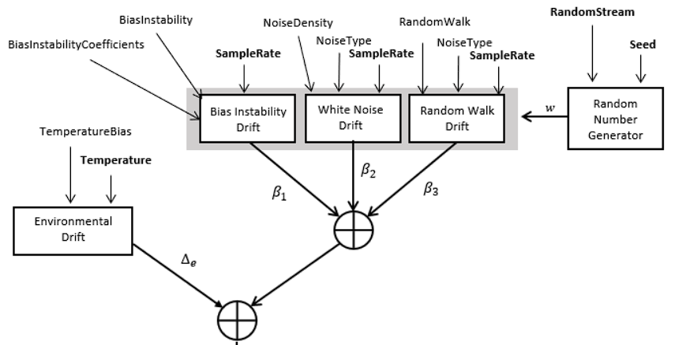
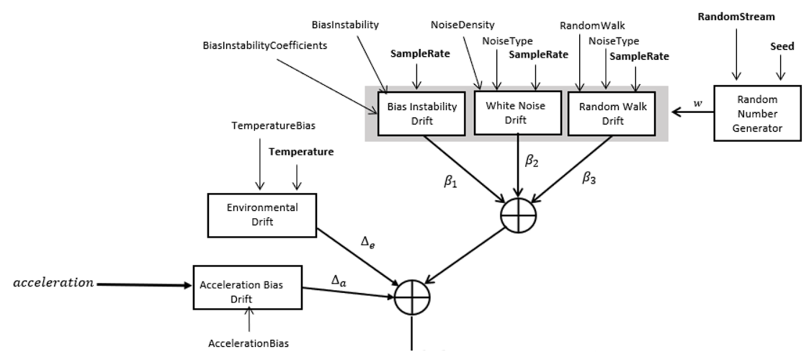

# References
	- [IMU simulation model - MATLAB (mathworks.com)](https://www.mathworks.com/help/nav/ref/imusensor-system-object.html)
- ## Generate Random Noise
	- ### Accelerometer
	  
	- ### Gyroscope
	  
	- ### Bias Instability Drift
	  The noise caused by Bias Instability can be generated through [fractalcoef](https://www.mathworks.com/help/fusion/ref/fractalcoef.html)
	  ```matlab
	  % Obtain filter coefficients
	  coeffs = fractalcoef(numPoles, alpha);
	  
	  % Generate white noise and filter the noise to obtain pink noise.
	  wn = randn(numSamples, 1);
	  pn = filter(coeffs.Numerator, coeffs.Denominator, wn);
	  ```
	  **alpha value (α)** for the fractal noise with a **power spectral density of 1/(f^α)**. When α = 1, the generated noise is also known as pink noise.
	  [Kasdin, N. J. “Discrete Simulation of Colored Noise and Stochastic Processes and 1/fα Power Law Noise Generation.” Proceedings of the IEEE, vol. 83, no. 5, May 1995, pp. 802–27.](https://ieeexplore.ieee.org/abstract/document/381848)