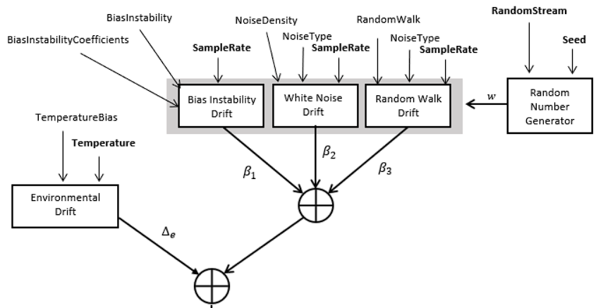

# References
	- [IMU simulation model - MATLAB (mathworks.com)](https://www.mathworks.com/help/nav/ref/imusensor-system-object.html)
- ## Generate Random Noise
	- ### Accelerometer
	  
	-
	- ### Gyroscope
	  
	-