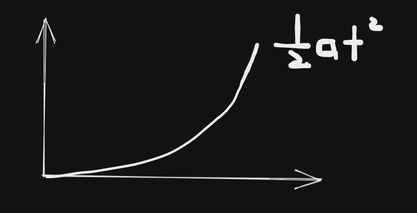

- {{renderer :tocgen}}
- ## Introduction to Inertial Navigation
	- ### Rigid body modelling in space
	  Time varying position & attitude of moving object
	  **Navigation State/Sensors/System, Navaid**
	- ### Forms of Navigation
		- Relative
		  init coordinate,  velocity, heading
		- Absolute
		  Measurements are made with respect to a **reference system**
	- ### Principle
	  $v=v_0+\int a\ dt$ <=> $s = s_0 + \int v\ dt = s_0 + v_0 t + \int a\ dt\ dt$
	  $a^n = R^n_b a^b$
	  where $R^n_b$ can be derived from gyroscope, $A^b$ can be derived from accelerometer
	- ### Accelerometer
		- Not possible to seperate gravitational measurement from motion measurement
		- Output of acceleration due to **gravitation is oppisite in sign** to the acceleration
		  =>specific force $f=a-g$
		- $$f=\frac{\Delta v}{\Delta t}$$
	- ### Gyroscope
		- Fiber Optical Gyro
		  phase difference between cw ccw signal
- ## Principle of Inertial Navigation
	- $X_t=\int \int a_x\ dt = \frac{1}{2} a_x t^2 + v_0 t + x_0$
	  
	- ### Reference Frames
	  Accel => $f^i_b$
	  Gyro => $\omega^b_{ib}=\omega^e_{ie} + \omega^n_{en} + \omega_m$ (stationary component + LLF rotation + motion rotation)
	- ### Theoretical Measurement of Stationary Accelerometer Traid
		- Level
	- ### Theoretical Measurement of Stationary yroscope Traid
		- Gyro
		  $$\omega=\omega^e + \omega^n_{en} + \omega_m$$
		  $\omega^n_en$: local level frame rotation due to the earth curvature
		  $\omega_m$: body rotation due to motion
	- $\omega^n_{in}=\omega^n_{ie}+\omega^n_{en}$
	  $\omega^n_{ib}=\omega^n_{in}+\omega^n_m$
	  $\omega^n_{ib}=R^n_b \omega^b_{ib}$
- ## Inertial Sensor Errors
	- ### Systematic errors
	  Repeatability
	  Stability or Drift-GM,AR,AI...
		- Bias
			- offset-deterministic
			  polynomial least-square fit
			- drift-stochastic
			  GM ...
		- Scale factor
		  (not exaclty linear)
	- ### Nonorthogonality Error
	  Accel & Gyros were assumed to be orthogonal
	  Nonorthogonality can cause **cross-axis signal coupling**
	- ### Stochastic Modeling of noise
		-