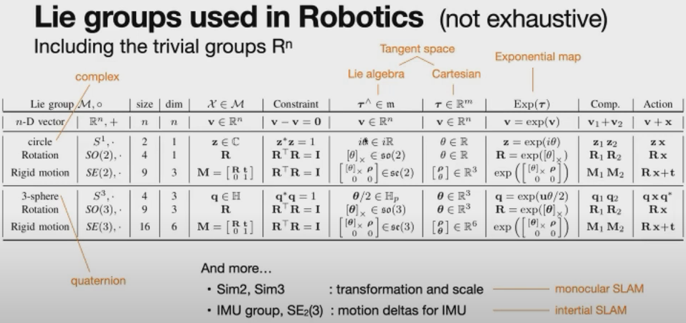
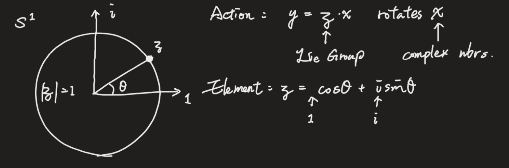
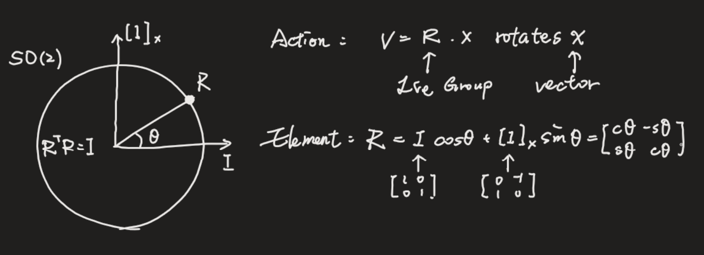
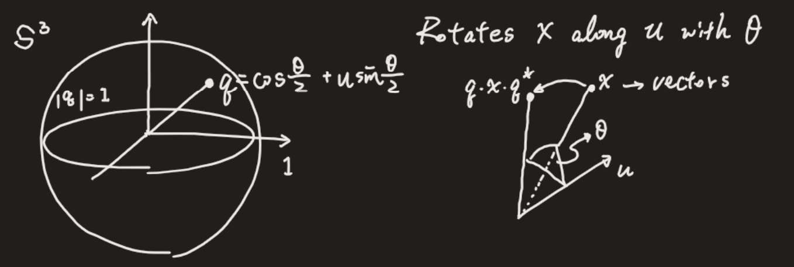

- # Lie Group
  #lie-group
- ## References
	- [Lie theory for the roboticist - YouTube](https://www.youtube.com/watch?v=csolG83gCV8&t=1136s&ab_channel=InstitutdeRob%C3%B2ticaiInform%C3%A0ticaIndustrial%2CCSIC-UPC)
- ## Common Types of Lie Group
  **Def: a group that is also a smooth manifold**
  {:height 319, :width 659}
	- ### $S^1$: unit complex number
	  {:height 246, :width 692}
	- ### $SO(2)$: 2D rotation matrics
	  id:: 647b0a7a-7fb6-4712-9675-a635ff47ad5c
	  {:height 266, :width 715}
	- ### $S^3$ Unit Quaternion
	  {:height 229, :width 632}
	- ### $SE(2)$ Pose (position + attitude)  
	  $$
	  X (t) = 
	  \begin{bmatrix} 
	  R(t) & p(t) \\ 
	  0 & 1 \\ 
	  \end{bmatrix} $$
- ## The Tangent Space og SO(3)
  Extend from ((647b0a7a-7fb6-4712-9675-a635ff47ad5c))
	- Differentiate $R^T \cdot R = I$:  
	  $$
	  \dot{R^T} R + R^T \dot{R} = 0 \\
	  R^T \dot{R} = -(R^T \dot{R})^T\ (skew\ symmetric) \\
	  R^T \dot{R} = 
	  \begin{bmatrix}
	   0 & -\omega_z & \omega_y \\
	  \omega_z & 0 & -\omega_x \\
	  -\omega_y & \omega_x & 0
	  \end{bmatrix}
	  $$
	- When $R = I$  
	  $$
	  \dot{R} = \omega_\times = 
	  \begin{bmatrix}
	   0 & -\omega_z & \omega_y \\
	  \omega_z & 0 & -\omega_x \\
	  -\omega_y & \omega_x & 0
	  \end{bmatrix}
	  $$