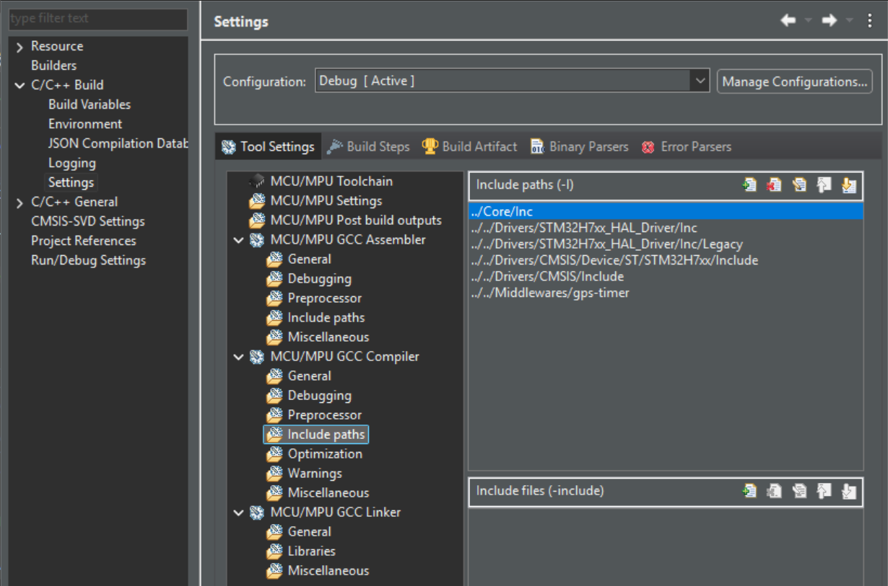
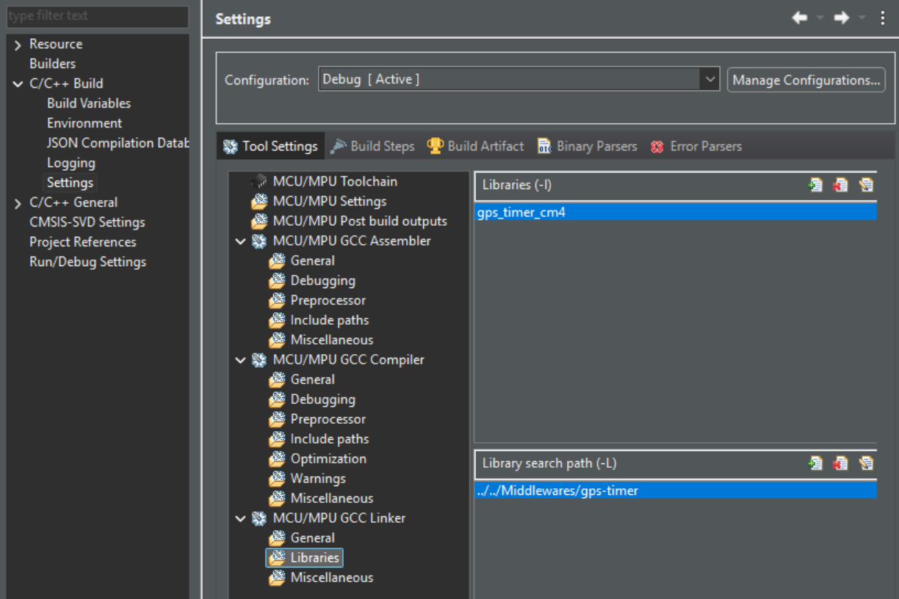
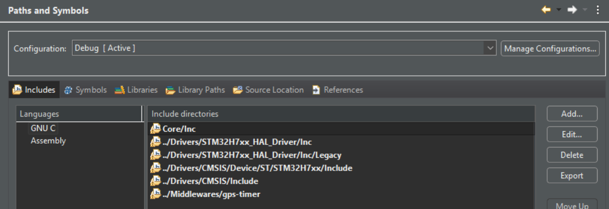
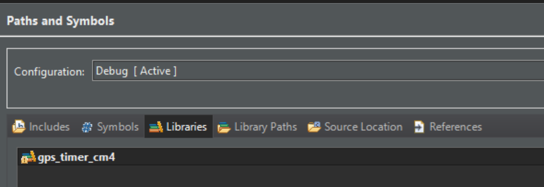
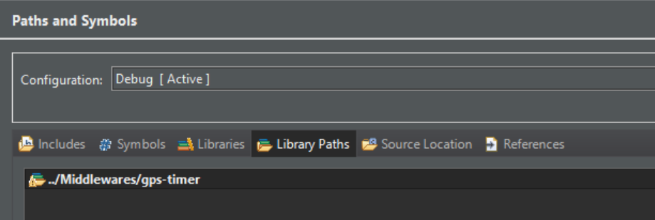

- #[[STM/Cube IDE]] #[[Link Library]]
- ## Project Properties
	- ### C/C++ Build
		- **MCU/MPU GCC Compiler > Include paths (*.h)**
		  logseq.order-list-type:: number
			- 
		- **MCU/MPU GCC Linker > Libraries (*.a)**
		  logseq.order-list-type:: number
			- Add  static library name to Libraries:
				- If library file name is **libgps_timer_cm4.a** then
				- type the filename as **gps_timer_cm4** (**without** `lib` and `*.a`)
			- Add library path to Library search path
			- 
	- ### C/C++ General > Path and Symbols
		- Include Path
			- 
		- Libraries
			- 
			- 