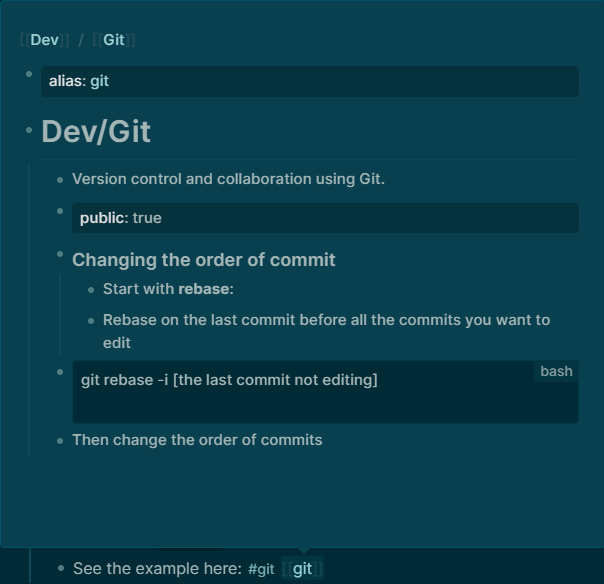

alias:: [[tag organize]]

- #logseq #tag #namespace #alias
- # Logseq Tag Organization Guide
	- This guide documents the **"Merge & Redirect"** workflow for grouping tags under namespaces while keeping the text in your notes short and readable.
	- ## The Goal
		- To move a tag like `#git` into a namespace like `#Dev/Git` **without** changing the text in your existing notes to the long version.
	- ## The Workflow (Step-by-Step)
		- ### 1. Create the Namespace Page
			- Create the new page with the full hierarchy.
			- **Example:** Create `Dev/Git`
		- ### 2. Set the Alias (Isolated Block)
			- In the **very first block** of the new page, add the `alias::` property.
			- **Crucial Rule:** The `alias::` property MUST be alone in this block for perfect indexing.
			- **Example Block 1:** `alias:: git`
			- **Example Block 2:** `# Dev/Git`
		- ### 3. Migrate Content
			- If the original short-name page (`git`) has any notes, copy them over to the new namespace page starting from the second block.
		- ### 4. Delete the Original Page
			- Delete the original short-name page (`git`).
			- **The Result:** Logseq will now "soft redirect" all existing `#git` or `[[git]]` links to the new `Dev/Git` page. Your notes stay short, but your graph is organized!
			- See the example here: #git [[git]]
			  
	- ## Summary of Rules
		- **Namespaces:** Use them for logical grouping (e.g., `Linux/`, `Dev/`, `Hardware/`).
		- **Aliases:** Use them to keep your tags quick to type and easy to read.
		- **Property Isolation:** Always keep `alias::` in its own top-level block.