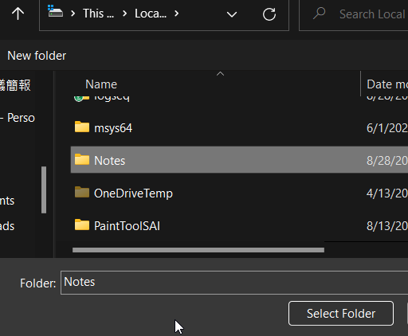
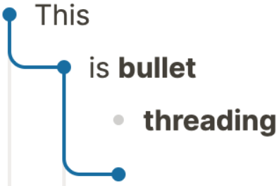
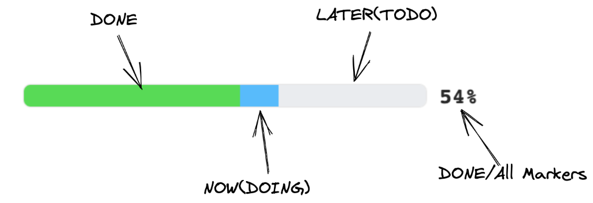

- # Sync Logseq with Github
	- 1. Create repository on Github
	  2. Clone the repository to local directories
	  3. Press  and select **Add new graph**
	  4. Choose the folder for local repository
	  
	  5. All the pages will be store in **YOUR_REPO/pages/*.md**
- # Useful Plugins
	- [logseq-plugin-git](https://github.com/haydenull/logseq-plugin-git)
	  Provide buttons for quick git operating (git status, git log, git commit, git pull, git push)
	- [logseq-plugin-bullet-threading](https://github.com/pengx17/logseq-plugin-bullet-threading)
	  
	- [logseq-plugin-todo-master](https://github.com/pengx17/logseq-plugin-todo-master)
	  