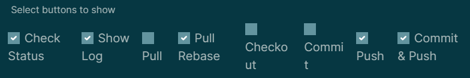
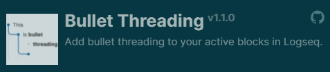
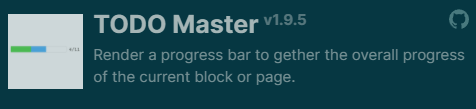

- # Sync Logseq with Github
	- 1. Create repository on Github
	  2. Clone the repository to local directories
- # Useful Plugins
	- ## Git
	  Provide buttons for quick git operating (git status, git log, git commit, git pull, git push)
	   
	  
	- ## Bullet Threading
	  
	- ## \TODO Master
	  