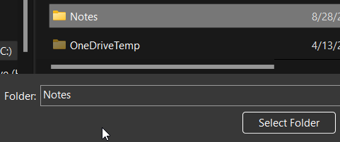

- # Sync Logseq with Github
	- 1. Create repository on Github (eg: Note)
	  2. Clone the repository to local directories
	  3. Press  and select **Add new graph**
	  4. Choose the folder (eg: Note) for local repository  
	   
	  5. All the pages will be store in **<your repo>/pages/*.md**
	  6. Save your work to Github with [logseq-plugin-git](https://github.com/haydenull/logseq-plugin-git) or press `ctrl+shift+1` to excecute git comment manually
- # Useful Plugins
	- [logseq-plugin-git](https://github.com/haydenull/logseq-plugin-git)  
	  Provide buttons for quick git operating (git status, git log, git commit, git pull, git push)
	- [logseq-plugin-bullet-threading](https://github.com/pengx17/logseq-plugin-bullet-threading)
	- [logseq-plugin-todo-master](https://github.com/pengx17/logseq-plugin-todo-master)