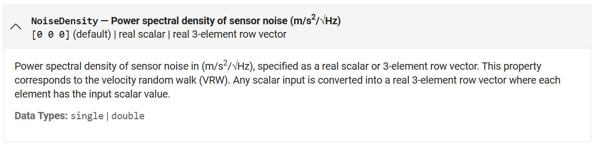
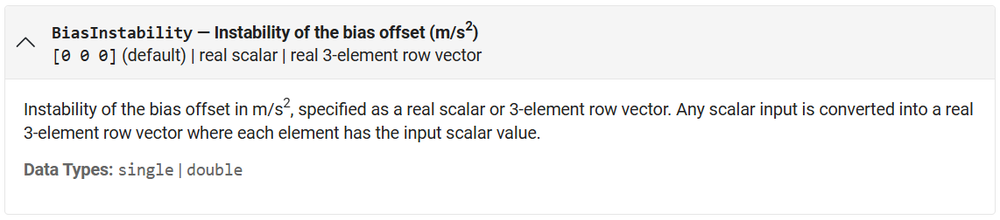
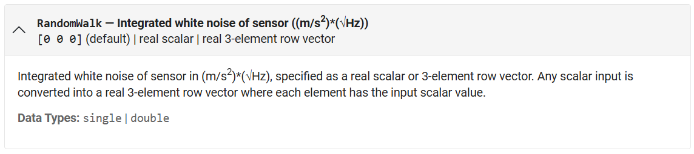
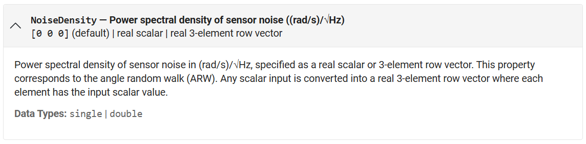
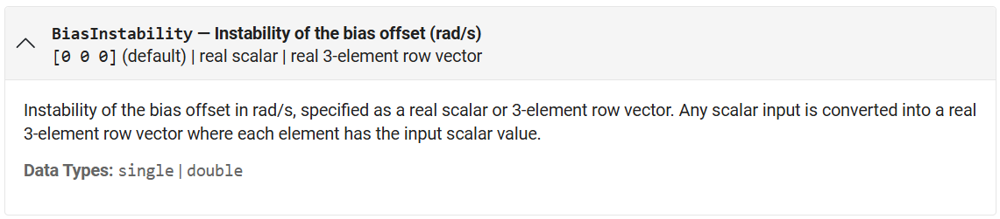
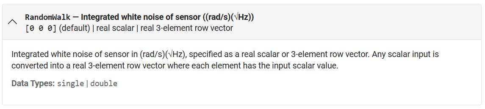
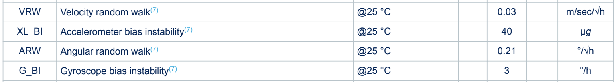

## Matlab imuSensor
According to [imuSensor - IMU simulation model - MATLAB](https://www.mathworks.com/help/nav/ref/imusensor-system-object.html), three sensors are included:
	- Accelerometer (accel) - [accelparams](https://www.mathworks.com/help/releases/R2025a/nav/ref/accelparams.html)
	- Gyroscope (gyro) - [gyroparams](https://www.mathworks.com/help/releases/R2025a/nav/ref/gyroparams.html)
	- Magnetometer (mag) - [magparams](https://www.mathworks.com/help/releases/R2025a/nav/ref/magparams.html)
- ### Accelerometer
  Let's look at the commonly used parameters: **Noise Density**, **Accel Bias Instability**, **Random Walk**.
	- #### !!! Warning !!!
	  by Matlab website, **VRW** correspond to `NoiseDensity` instead of ~~`RandomWalk`~~!!!
	- #### Noise Density $(m/s^2/\sqrt{Hz})$ (VRW) 
	  
	- #### Bias Instability $(m/s^2)$
	  
	- #### Random Walk $(m/s^2 * \sqrt{Hz})$
	  
- ### Gyroscope
	- #### !!! Warning !!!
	  by Matlab website, **ARW** correspond to `NoiseDensity` instead of ~~`RandomWalk`~~!!!
	- #### Noise Density $(rad/s/\sqrt{Hz})$ (ARW)
	  
	- #### Bias Instability $(rad/s)$
	  
	- #### Random Walk $(rad/s * \sqrt{Hz})$
	  
- ### Unit Convert Example
	- #### ASM330LHB
	  
		- **VRW**
		  $= 0.03\ m/sec/\sqrt{h}$
		  $= 0.03\ (m/s)/(60\sqrt{s})$
		  $= 0.03 \times \frac{1}{60}\ (m/s)/(s \times \frac{1}{\sqrt{s}}), where \frac{1}{\sqrt{s}}=\sqrt{Hz}$
		  $= 0.03 \times \frac{1}{60}\ m/s^2/\sqrt{Hz}$
		- **XL_BI**
		  $= 40\ \mu g$
		  $= 40 \times 10^{-6}\ g = 40 \times 10^{-6} \times 9.8\ g$
		- **ARW**
		  $= 0.21\ \degree/\sqrt{h}$
		  $= 0.21 \times \frac{PI}{180}\ rad/60\sqrt{s}$
		  $= 0.21 \times \frac{PI}{180 \times 60}\ rad/(s \times \frac{1}{\sqrt{s}}), where \frac{1}{\sqrt{s}}=\sqrt{Hz}$
		  $= 0.21 \times \frac{PI}{180} \times 60\ rad/s/\sqrt{Hz}$
		- **G_BI**
		  $= 3\ \degree/h$
		  $= 3 \times \frac{PI}{180}\ rad/3600s = 3 \times \frac{1}{3600} \times \frac{PI}{180}\ rad/s$
-