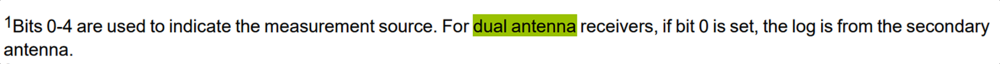
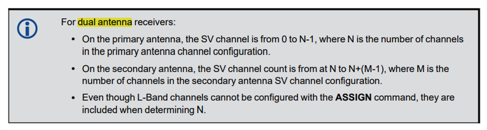
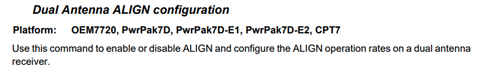
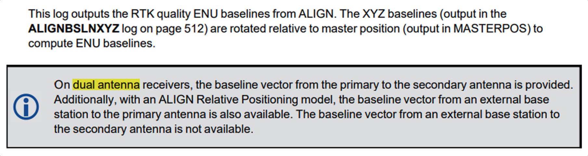
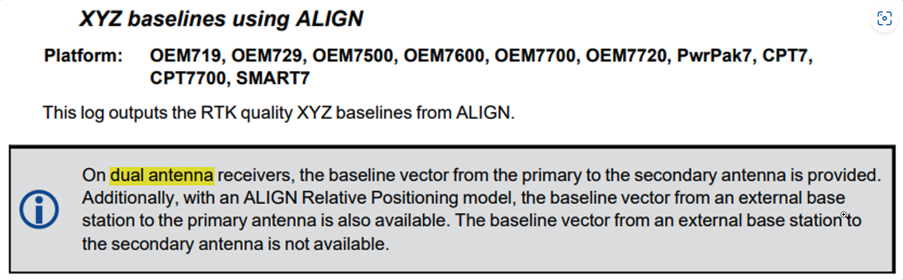
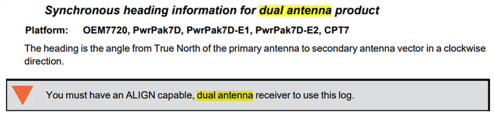
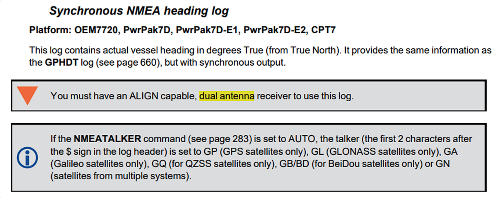
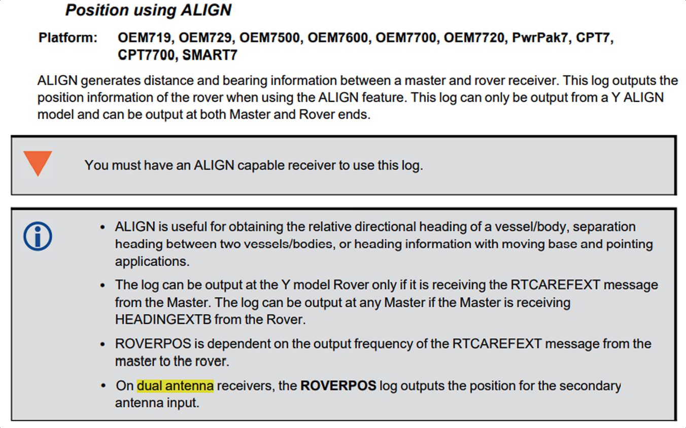
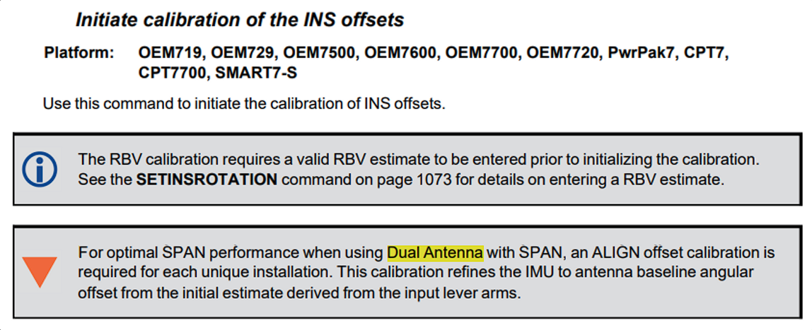

public:: true

- # Novatel Manual
- ## OEM7 Commands and Logs
	- ### Document
		- [OEM7 Commands Logs Manual](https://docs.novatel.com/OEM7/Content/PDFs/OEM7_Commands_Logs_Manual.pdf)
	- ### Dual Antenna Study
	  collapsed:: true
		- Binary Message Header Structure  
		  Field 6: Message Type: Bit 0-4 Measurement source  
		  
		- ASSIGN/UNASSIGN (SV Numbers for Dual Antenna )  
		  
		- DUALANTENNAALIGN  
		  
		- ALIGNBSLNENU  
		  
		- ALIGNBSLNXYZ  
		  
		- **DUALANTENNAHEADING**  
		  
		- GPHDTDUALANTENNA  
		  
		- ROVERPOS  
		  
		- INSCALIBRATE  
		  
	-
-