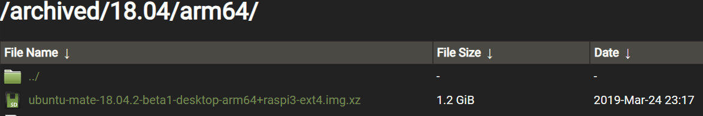

- #raspi #ROS
- {{renderer :tocgen2}}
- ## Raspberry Pi 4B
	- ### Reference
		- [Install Ubuntu MATE 18.04 and ROS on Raspberry Pi 3 B+ | by Rishabh Dev Yadav | Medium](https://rishabhdevyadav.medium.com/install-ubuntu-mate-18-04-and-ros-on-raspberry-pi-3-b-7ff84688fa37)
		- [melodic/Installation/Ubuntu - ROS Wiki](http://wiki.ros.org/melodic/Installation/Ubuntu)
		  id:: 6547e905-f91a-4fac-adbe-13fbcf7f3bad
	- ### Raspberry Pi OS (Ubuntu MATE)
		- It is suggested to use **Ubuntu MATE** for a **Raspberry Pi + ROS** system. Because the ROS1 system only works in ubuntu distribution before 20.04. It's necessary to download the legacy version. All released Ubuntu MATE version can be download from [Ubuntu MATE Releases - /archived/ (ubuntu-mate.org)](https://releases.ubuntu-mate.org/archived/). Be aware that Raspberry Pi is base on **ARM** architecture. According to the Raspberry Pi we use, the architecture might be **arm64 (64 bit)** or **armhf (32 bit)**, which is listed in [Raspberry Pi OS (64-bit) - Raspberry Pi](https://www.raspberrypi.com/news/raspberry-pi-os-64-bit/).
			- In my case: **Raspberry Pi 3B+** & **Ubuntu MATE 18.04 (arm64)**
			  
	- ### Install OS
		- ## Install Ubuntu MATE 18.04
		- ## Enable SSH
		  Installation
		  ```bash
		  sudo apt-get install openssh-server
		  sudo systemctl enable ssh
		  sudo systemctl start ssh
		  ```
	- ### Install ROS (Melodic)
	  Follow the steps on ((6547e905-f91a-4fac-adbe-13fbcf7f3bad))
		- ### Setup sources.lists
		  ```bash
		  sudo sh -c 'echo "deb http://packages.ros.org/ros/ubuntu $(lsb_release -sc) main" > /etc/apt/sources.list.d/ros-latest.list'
		  ```
		- ### Setup keys
		  ```bash
		  sudo apt install curl
		  curl -s https://raw.githubusercontent.com/ros/rosdistro/master/ros.asc | sudo apt-key add -
		  ```
		- ### Official Installation Instruction
		  First,
		  ```bash
		  sudo apt update
		  sudo apt upgraade
		  ```
		  There are several ways to install ROS
			- Desktop-Full Install : `sudo apt install ros-melodic-desktop-full`
			- Desktop Install : `sudo apt install ros-melodic-desktop`
			- ROS-Base : `sudo apt install ros-melodic-ros-base`
			- Individual Package : `sudo apt install ros-melodic-PACKAGE`
		- ### Customized Installation
		  Some dependences required by ros-melodic-desktop was unmet, eg: ((6547f225-256e-4cb8-af48-10324ab51a77)). It is suggested to install **ROS-Base**, then install other packages afterward.
		  ```bash
		  sudo apt install ros-meldoic-ros-base
		  sudo apt install ros-melodic-rviz
		  sudo apt install ros-melodic-rqt
		  ```
		- ## Errors
			- unmet dependencies error
			  id:: 6547f225-256e-4cb8-af48-10324ab51a77
			  ```bash
			  ts@ts-raspi:~$ sudo apt install ros-melodic-desktop-full
			  [sudo] password for ts:
			  Reading package lists... Done
			  Building dependency tree
			  Reading state information... Done
			  Some packages could not be installed. This may mean that you have
			  requested an impossible situation or if you are using the unstable
			  distribution that some required packages have not yet been created
			  or been moved out of Incoming.
			  The following information may help to resolve the situation:
			  
			  The following packages have unmet dependencies:
			   ros-melodic-desktop-full : Depends: ros-melodic-perception but it is not going to be installed
			  E: Unable to correct problems, you have held broken packages.
			  ```
- ## Raspberry Pi 5
	- ### Reference
		- [Ubuntu (deb packages) — ROS 2 Documentation: Jazzy documentation](https://docs.ros.org/en/jazzy/Installation/Ubuntu-Install-Debs.html)
	- ### ROS 2
		- ### [Set locale](https://docs.ros.org/en/jazzy/Installation/Ubuntu-Install-Debs.html#id3)
		  ```bash
		  locale  # check for UTF-8
		  
		  sudo apt update && sudo apt install locales
		  sudo locale-gen en_US en_US.UTF-8
		  sudo update-locale LC_ALL=en_US.UTF-8 LANG=en_US.UTF-8
		  export LANG=en_US.UTF-8
		  
		  locale  # verify settings
		  ```
		- ### [Enable required repositories](https://docs.ros.org/en/jazzy/Installation/Ubuntu-Install-Debs.html#id4)
		  ```bash
		  sudo apt install software-properties-common
		  sudo add-apt-repository universe
		  ```
		  ```bash
		  sudo apt update && sudo apt install curl -y
		  export ROS_APT_SOURCE_VERSION=$(curl -s https://api.github.com/repos/ros-infrastructure/ros-apt-source/releases/latest | grep -F "tag_name" | awk -F'"' '{print $4}')
		  curl -L -o /tmp/ros2-apt-source.deb "https://github.com/ros-infrastructure/ros-apt-source/releases/download/${ROS_APT_SOURCE_VERSION}/ros2-apt-source_${ROS_APT_SOURCE_VERSION}.$(. /etc/os-release && echo ${UBUNTU_CODENAME:-${VERSION_CODENAME}})_all.deb"
		  sudo dpkg -i /tmp/ros2-apt-source.deb
		  ```
		- ### [Install development tools (optional)](https://docs.ros.org/en/jazzy/Installation/Ubuntu-Install-Debs.html#id5)
		  ```bash
		  sudo apt update && sudo apt install ros-dev-tools
		  ```
		- ### [Install ROS 2](https://docs.ros.org/en/jazzy/Installation/Ubuntu-Install-Debs.html#id6)
		  ```bash
		  sudo apt update
		  sudo apt upgrade
		  sudo apt install ros-jazzy-desktop
		  ```
		  ```bash
		  source /opt/ros/jazzy/setup.bash
		  ```
		- ### [Try some examples](https://docs.ros.org/en/jazzy/Installation/Ubuntu-Install-Debs.html#id9)
		  ```bash
		  ros2 run demo_nodes_cpp talker
		  ros2 run demo_nodes_py listener
		  ```