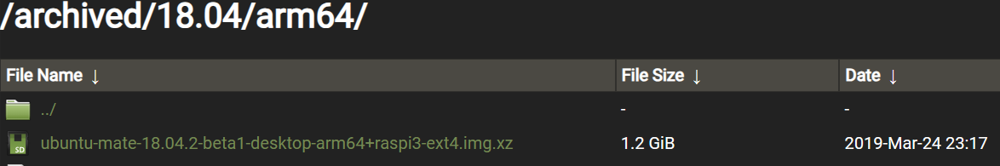

- {{renderer :tocgen2}}
- # Reference
	- [Install Ubuntu MATE 18.04 and ROS on Raspberry Pi 3 B+ | by Rishabh Dev Yadav | Medium](https://rishabhdevyadav.medium.com/install-ubuntu-mate-18-04-and-ros-on-raspberry-pi-3-b-7ff84688fa37)
	- [melodic/Installation/Ubuntu - ROS Wiki](http://wiki.ros.org/melodic/Installation/Ubuntu)
	  id:: 6547e905-f91a-4fac-adbe-13fbcf7f3bad
- # Raspberry Pi OS (Ubuntu MATE)
	- It is suggested to use **Ubuntu MATE** for a **Raspberry Pi + ROS** system. Because the ROS1 system only works in ubuntu distribution before 20.04. It's necessary to download the legacy version. All released Ubuntu MATE version can be download from [Ubuntu MATE Releases - /archived/ (ubuntu-mate.org)](https://releases.ubuntu-mate.org/archived/). Be aware that Raspberry Pi is base on **ARM** architecture. According to the Raspberry Pi we use, the architecture might be **arm64 (64 bit)** or **armhf (32 bit)**, which is listed in [Raspberry Pi OS (64-bit) - Raspberry Pi](https://www.raspberrypi.com/news/raspberry-pi-os-64-bit/).
		- In my case: **Raspberry Pi 3B+** & **Ubuntu MATE 18.04 (arm64)**
		  
- # Install OS
	- ## Install Ubuntu MATE 18.04
	- ## Enable SSH
	  {{embed ((64e5b599-a0b5-4fb6-8350-518b82dbbb2a))}}
- # Install ROS (Melodic)
  Follow the steps on ((6547e905-f91a-4fac-adbe-13fbcf7f3bad))