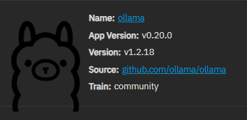
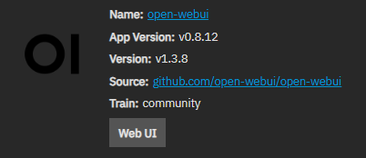
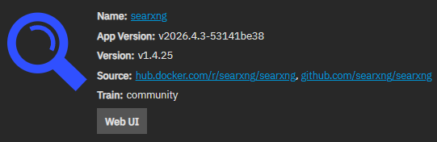

- #LLM #Gemma #Ollama #TrueNas #[[Open WebUI]] #SearXNG
- {{renderer :tocgen2}}
- ## Install Apps on TrueNas Scale
	- ### [[Ollama]]
		- 
	- ### [[Open WebUI]]
		- 
		- #### **Open WebUI Configuration**
			- **Image Selector*:**
			  Since we already have our own ollama server setup, we only need the very simple  Open WebUI
				- Standard Image (OpenAPI or External Ollama Server Usage)
			- **Ollama Base URL** or **OpenAI API Key**
				- https://HOST_IP:PORT/
			- **Redis Password***
				- Random password
			- **WebUI Secret Key***
				- Random Key
	- ### [[SearXNG]]
		- 
		- Simply use default setting
- ## Install Gemma4 with Ollama
- ## Web Search settings