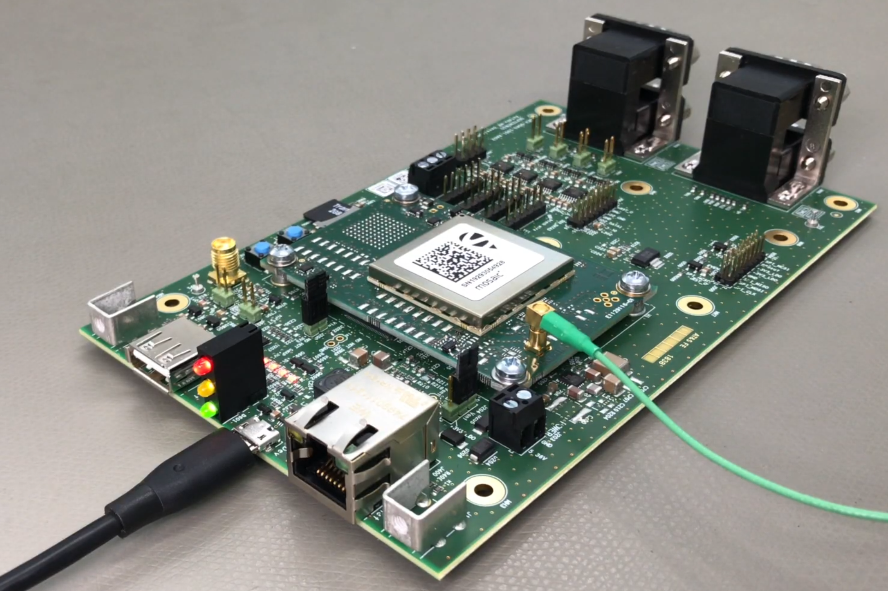

manufacturers:: Septentrio
model:: [[Mosaic-X5]] [[Mosaic-H]]
sensor:: GNSS
{{renderer :tocgen2}}

- ## Connecting to the EVK
  [mosaic - Getting started (septentrio.com)](https://customersupport.septentrio.com/s/article/mosaic-Getting-started)
  
  1. Connect **Antenna**, and connect **micro-USB** to computer like the figure below.
  {:height 354, :width 498}
  
  2. Connect to **Web UI** by typing `192.168.3.1` in browser
- ## Configuring Receiver
- ## RxTools