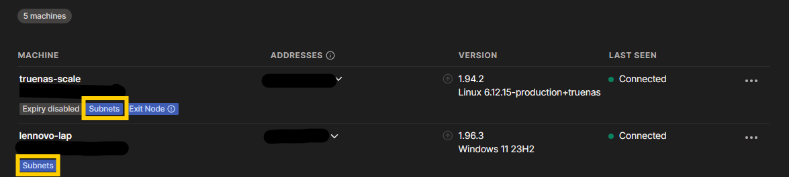

- #vpn
- TODO
- {{renderer :tocgen2}}
- ## Using Tailscale
	- ### Installation
		- [Install Tailscale · Tailscale Docs](https://tailscale.com/docs/install)
- ## [[Subnet Routers]]
	- [Subnet routers · Tailscale Docs](https://tailscale.com/docs/features/subnet-routers)
	- 
	- Tailscale Subnet Routers allows user **connect to the local network** using devices as router. For example:
		- Remote Desktop
		- SSH
		- Network Drive
	- ### Steps
		- #### Connect to tailscale as a subnet router
			- Enable IP forwarding
			  logseq.order-list-type:: number
			- Advertise subnet routes
			  logseq.order-list-type:: number
				- ```bash
				  sudo tailscale set --advertise-routes=192.0.2.0/24,198.51.100.0/24
				  ```
		- #### Enable subnet routes from admin console [Tailscale Web]
			- Find the machine and open the setting tab by pressing three dots on the right
			- **Three dots > Edit route settings ... >** and select the subnet desire to share