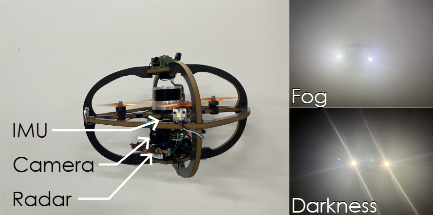

- #[[tightly coupled]] #Radar #visual #inertial #odometry
- {{renderer :tocgen2}}
- ## Source
	- [[2603.23052] Tightly-Coupled Radar-Visual-Inertial Odometry](https://arxiv.org/abs/2603.23052)
	  [[@Tightly-Coupled Radar-Visual-Inertial Odometry]]
	- [ntnu-arl/radvio: A tightly-coupled radar-visual-inertial odometry, to enable robust performance in challenging environments.](https://github.com/ntnu-arl/radvio/tree/main)
- ## Sensors
	- Radar: IWR6843AOP
		- ### Radar Chirp Configuration
		  | Parameter | Value | Unit |
		  |---|---|---|
		  | Starting Frequency | 60 | GHz |
		  | Maximum Range | 20.013 | m |
		  | Maximum Doppler | 3.995 | m/s |
		  | Range Resolution | 0.078 | m |
		  | Doppler Resolution | 0.133 | m/s |
		  | Azimuth/Elevation Resolution | 29 | ° |
		- Sensor intro
		  collapsed:: true
		  {{video https://youtu.be/P1pFrJgThc4}}
	- IMU: VectorNav VN10
	- Camera: Teledyne Blackfly S 0.4 MP
	- GNSS: Blox-M10S L1
- ## Platform Setup
	- 
- ## Main Filter Design
	- The system is based on an **Iterated Extended Kalman Filter (IEKF)** that tightly fuses IMU, visual, and radar data.
	- ### Filter State Vector
		- The state vector $\mathbf{x}$ is defined in the IMU frame:
			- **IMU State**: Position ($^W\mathbf{p}_I$), Velocity ($^W\mathbf{v}_I$), and Orientation ($^W\mathbf{q}_I$) in the world frame.
			- **IMU Biases**: Accelerometer bias ($\mathbf{b}_a$) and Gyroscope bias ($\mathbf{b}_g$).
			- **Visual Features**: Sliding window of visual feature positions or inverse depths.
			- $$\mathbf{x} = \begin{bmatrix} {}_I\mathbf{r}_{IB} & \mathbf{q}_{IB} & {}_I\mathbf{v}_B & \mathbf{b}_a & \mathbf{b}_g & \boldsymbol{\theta}_{ext} & \mathbf{f}_1 & \dots & \mathbf{f}_n \end{bmatrix}^T$$
	- ### Propagation Model
		- **Dynamics**: Follows standard IMU kinematics for state propagation.
			- **Continuous-time dynamics**:
				- $\dot{\mathbf{p}} = \mathbf{v}$
				- $\dot{\mathbf{v}} = \mathbf{R}(\mathbf{q}) (\mathbf{a}_m - \mathbf{b}_a - \mathbf{n}_a) + \mathbf{g}$
				- $\dot{\mathbf{q}} = \frac{1}{2} \mathbf{q} \otimes \begin{bmatrix} 0 \\ \boldsymbol{\omega}_m - \mathbf{b}_g - \mathbf{n}_g \end{bmatrix}$
				- $\dot{\mathbf{b}}_a = \mathbf{n}_{ba}, \quad \dot{\mathbf{b}}_g = \mathbf{n}_{bg}$
		- **Integration**: Continuous-time dynamics are integrated (e.g., RK4) with additive Gaussian noise for biases and raw measurements.
		- **Covariance**: Error-state covariance is propagated using the Jacobian of the motion model.
	- ### Measurement Models
		- **Visual Feature Update**:
			- Uses a standard perspective projection model.
				- Photometric error for a feature patch:
				  $$e_{patch} = I_k(\pi(\mathbf{T}_{CK} \cdot \mathbf{f})) - P$$
			- Residuals are based on the re-projection error of tracked features across the sliding window.
		- **Radar Doppler Update**:
			- Relates radial velocity ($v_r$) to sensor ego-motion: $v_r = \mathbf{n}^\top (\mathbf{v}_R + \boldsymbol{\omega}_R \times \mathbf{r})$.
				- Full radial velocity model:
				  $$v_{r,i} = \mathbf{n}_i^T \left( {}^R\mathbf{v} + {}^R\boldsymbol{\omega} \times {}^R\mathbf{r}_i \right) + \eta_i$$
				  Where $\mathbf{n}_i = \frac{{}^R\mathbf{r}_i}{\|{}^R\mathbf{r}_i\|}$ is the unit bearing vector.
			- Provides a direct constraint on the velocity state, enhancing robustness in visually degraded or high-dynamic environments.
		- **Radar Range (Depth Augmentation)**:
			- Primarily used for **Visual Feature Depth Initialization**.
			- Radar point clouds are spatially correlated with visual features to provide an initial depth estimate, improving scale consistency.