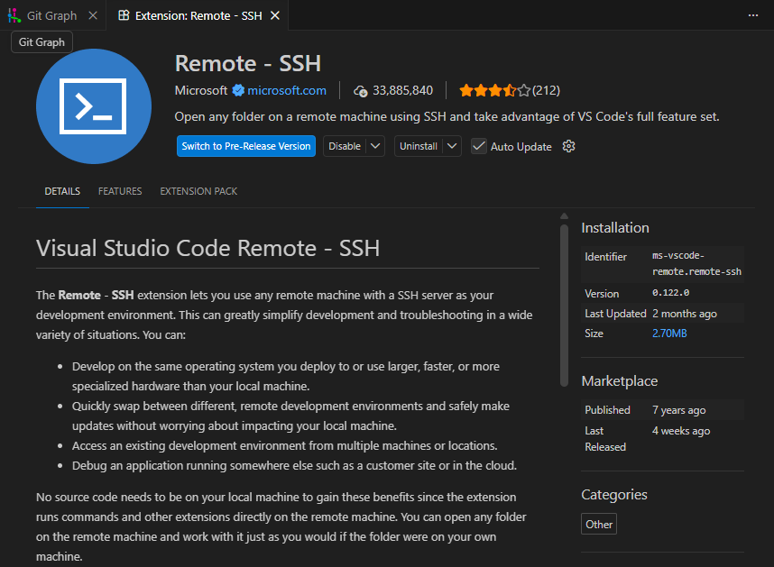
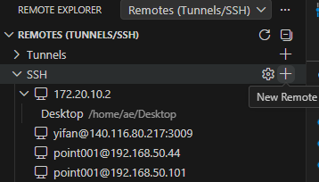
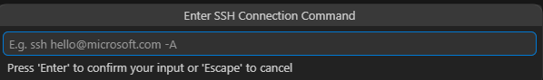
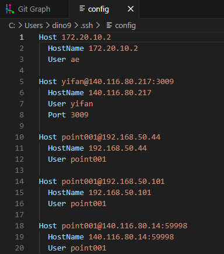

- #[[VS Code]] #ssh
- ## Connect to SSH server through VS Code With Remote-SSH
	- ### Installation
		- 
	- ### Add New Remote
		- 
		- 
		- 
- ## ~~Visualizing SSH server GUI with X11~~ (Deprecated)
  Reference from [使用VScode配置免密登录服务器，以及配置X11转发显示GUI窗口 - 掘金 (juejin.cn)](https://juejin.cn/post/7009593663894323231)  
  This method required vscode extensions: **Remote X11** & **Remote X11 (SSH)**
- ## Use MobaXterm Xserver