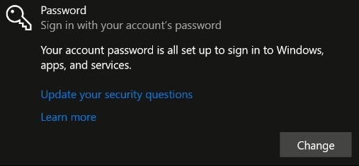

public:: true
title:: VS-Code-SSH
#vscode #ssh

- # Install SSH server
	- ## Linux as server
		- Installation
		  id:: 64e5b599-a0b5-4fb6-8350-518b82dbbb2a
		  ```bash
		  sudo apt-get install openssh-server
		  sudo systemctl enable ssh
		  sudo systemctl start ssh
		  ```
	- ## Win as server
		- Installation
		  1. Open **Settings**, select **Apps**, then select **Optional Features**
		  2. If OpenSSH is not installed yet, select **Add a feature**, install **OpenSSH Client** & **OpenSSH Server**
		- Start-Service sshd
		  Set-Service -Name sshd -StartupType 'Automatic'
		  Get-NetFirewallRule -Name *ssh*
		- **Remember to setup login password** in **Settings > Accounts > Sign-in options**
		  
- # Connect to SSH server through VS Code
	- ## With Remote-Explorer
		- ### Installation
- # Visualizing SSH server GUI with X11
  Reference from [使用VScode配置免密登录服务器，以及配置X11转发显示GUI窗口 - 掘金 (juejin.cn)](https://juejin.cn/post/7009593663894323231)  
  This method required vscode extensions: **Remote X11** & **Remote X11 (SSH)**
	- ## Setup ssh keys
	-