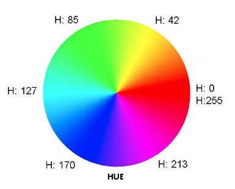

title:: fastled-lightstrip
#arduino #fastled #lightstrip #embedded

- # FastLED Lightstrip
- [FastLED Basic Usage](https://github.com/FastLED/FastLED/wiki/Basic-usage)
- ## HSV(Hue, Saturation, Value) Color
	- ### Hue:
	  
	- ### Saturation:
	  0 (White) -> 255 (Colored)
	- ### Value:
	  0 (Dark) -> 255 (Bright)