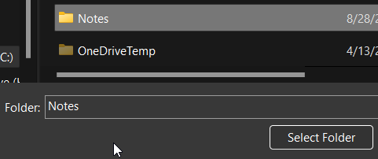

- #logseq #note
  id:: 657d6955-bb8c-4932-925d-6da8f8a6a606
- ## Sync Logseq with [Github](github)
	- 1. Create repository on Github (eg: Note)
	- 2. Clone the repository to local directories
	- 3. Press  and select **Add new graph**
	- 4. Choose the folder (eg: Note) for local repository    
	  
	- 5. All the pages will be store in `<your repo>/pages/*.md`
	- 6. Save your work to Github with [logseq-plugin-git](https://github.com/haydenull/logseq-plugin-git) by pressing `Ctrl + S`
- ## Useful Plugins
	- [logseq-plugin-git](https://github.com/haydenull/logseq-plugin-git)  
	  Provide buttons for quick git operating (git status, git log, git commit, git pull, git push)
	- [logseq-plugin-bullet-threading](https://github.com/pengx17/logseq-plugin-bullet-threading)
	- [logseq-plugin-todo-master](https://github.com/pengx17/logseq-plugin-todo-master)
	- [Logseq Markdown Table Editor](https://github.com/haydenull/logseq-plugin-markdown-table)
	- ~~[logseq-formula-ocr-plugin](https://github.com/olmobaldoni/logseq-formula-ocr-plugin)~~ (deprecated, use GPT, Gemini, Claude ... instead)
- ## Themes
	- [logseq-dev-theme](https://github.com/pengx17/logseq-dev-theme)
	- [logseq-bonofix-theme: A clean logseq theme focus on bujo and long time writing experience](https://github.com/sansui233/logseq-bonofix-theme)
	- [logseq-atlas-theme](https://github.com/sethfair/logseq-atlas-theme)
- ## Useful References
	- [開源筆記軟體Logseq【第三篇-進階語法功能】](https://www.cc.ntu.edu.tw/chinese/epaper/home/20221220_006309.html)