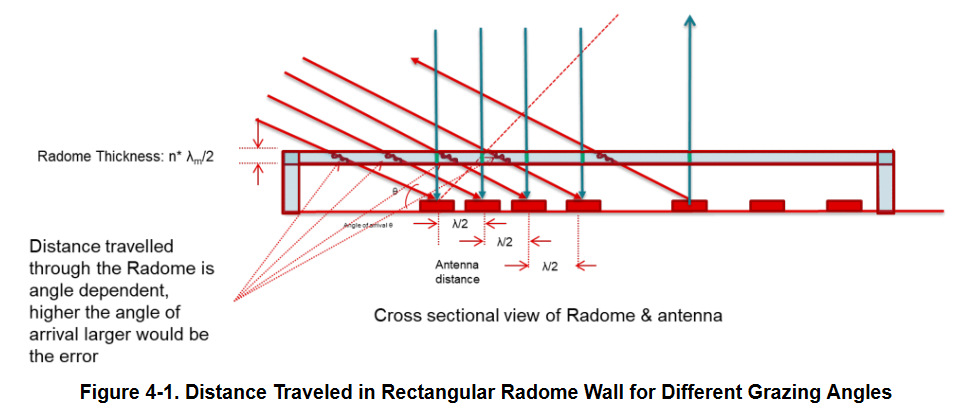
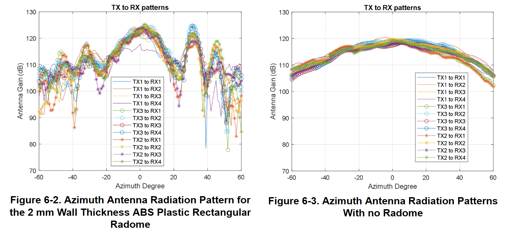

- #mmwave #radar #radome
- ## Source: [mmWave Radar Radome Design Guide](https://www.ti.com/lit/an/swra705/swra705.pdf)
- 
- 
- ## 名詞翻譯
	- Radome: 天線罩
	- Dielectric constant: 介電常數
		- 決定電磁波在物體中的傳播速度
-