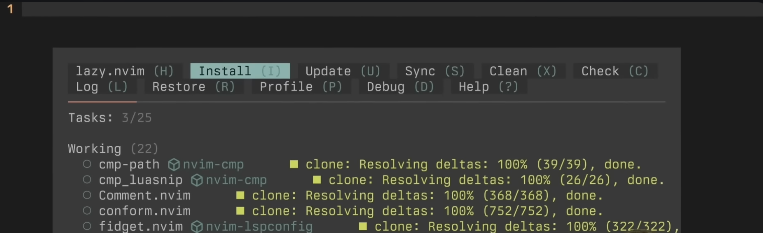

alias:: nvim

- #vim #IDE #code
- ## Resource
	- [The Only Video You Need to Get Started with Neovim](https://www.youtube.com/watch?v=m8C0Cq9Uv9o)
	- [nvim-lua/kickstart.nvim: A launch point for your personal nvim configuration](https://github.com/nvim-lua/kickstart.nvim)
- ## Installation
	- Install nvim
	- Install external dependencies
	  describe in [link](https://github.com/nvim-lua/kickstart.nvim?tab=readme-ov-file#alternative-neovim-installation-methods)
		- For Ubuntu
		  ```bash
		  sudo add-apt-repository ppa:neovim-ppa/unstable -y
		  sudo apt update
		  sudo apt install make gcc ripgrep fd-find tree-sitter-cli unzip git xclip neovim
		  ```
	- Copy the clone link from [nvim-lua/kickstart.nvim](https://github.com/nvim-lua/kickstart.nvim)
	  ```bash
	  git clone https://github.com/nvim-lua/kickstart.nvim.git "${XDG_CONFIG_HOME:-$HOME/.config}"/nvim
	  ```
	- Then run neovim by typing `nvim` in the terminal
	  ```bash
	  nvim
	  ```
		- the plugin installation will start automatically by `:lazy`
		  
-