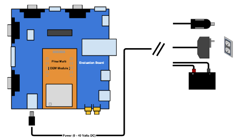

- # swift-Navigation-Piksi-Multi-Evaluation-Kit
  title:: swift-Navigation-Piksi-Multi-Evaluation-Kit
- ## Document
	- [Swift Navigation Support](https://support.swiftnav.com/support/home)
		- [Piksi Multi Getting Started Guide](https://support.swiftnav.com/support/solutions/articles/44001850752-piksi-multi-getting-started-guide)
		  id:: 63a875c1-226a-4e32-a871-c3f3b5737408
		- [Piksi Multi & Piksi Multi Inertial Specification](https://support.swiftnav.com/support/solutions/articles/44001850753-piksi-multi-piksi-multi-inertial-specification)
- ## Quike Start
  Follow the guide from ((63a875c1-226a-4e32-a871-c3f3b5737408))
	- ### Install Swift Console
	  WinOS/MacOS/Linux
	  [Resource Library | Swiftnav](https://www.swiftnav.com/resource-library?filters=no&title=Swift+Console&search=Swift+Console&product=Swift+Console&category=Installer&release=Latest)
	- ### Install USB to Serial Adpter Drivers (FTDI's VCP)
	  [VCP Drivers - FTDI (ftdichip.com)](https://ftdichip.com/drivers/vcp-drivers/)
	- ### Powering Piksi Multi
	  For test and evaluation, it is recommended to use the Piksi Multi Evaluation Board for convenience which is powered via a 5.5/2.1 mm barrel jack. In the field, we have a variety of recommendations for powering the evaluation board.
	  
	  Power supply voltage ranges
		- Piksi Multi GNSS Module: 5 to 15 V DC
		- Piksi Multi Evaluation Board: 9 to 40 V DC
	-
-