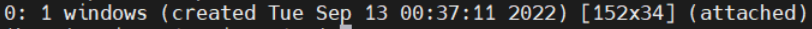

- ## Installing tmux
	- ```bash
	  sudo apt-get install tmux
	  ```
- ## Basic commands
	- ### System Operating
		- **<prefix> ?**    help for Hotkeys
		- **<prefix> d**    Detach current session
		- **<prefix> s**    Switch session
		- **<prefix> [**    enter Copy mode
- ## Customization
  The configuration should be in the home directory `~/.tmux.conf`. Create if not exist.
	- ### Changing Prefix Combo
	  The default prefix combo is (**Ctrl+b**) which wasn't very natural
		- Remapping to **Ctrl+a**
		  ```
		  set -g prefix2 C-a                        # GNU-Screen compatible prefix
		  bind C-a send-prefix -2
		  ```
	- ### Navigation
	  The default Navigation between Windows/Panes require prefix combo + arrow
		- **Shift/Alt + Arrow Keys (←→↑↓)** Navigation
		  ```
		  # Use Alt-arrow keys without prefix key to switch panes
		  bind -n M-Left select-pane -L
		  bind -n M-Right select-pane -R
		  bind -n M-Up select-pane -U
		  bind -n M-Down select-pane -D
		  
		  # Shift arrow to switch windows
		  bind -n S-Left  previous-window
		  bind -n S-Right next-window
		  ```
		- **Shift/Alt + vim Keys (hjkl)** Navigation
		  ```
		  # Vim style pane selection
		  bind h select-pane -L
		  bind j select-pane -D
		  bind k select-pane -U
		  bind l select-pane -R
		  
		  # Use Alt-vim keys without prefix key to switch panes
		  bind -n M-h select-pane -L
		  bind -n M-j select-pane -D
		  bind -n M-k select-pane -U
		  bind -n M-l select-pane -R
		  ```
- ## Sessions
	- ### Check existing Session
		- `tmux list-session`
		  
	- ### Open existing session
		- `tmux attach -t n` where **n** is the index of the session
- ## References
	- [Customizing TMUX for Efficiency and Aesthetics: Part 1](https://blog.yarsalabs.com/customising-tmux-part1/)